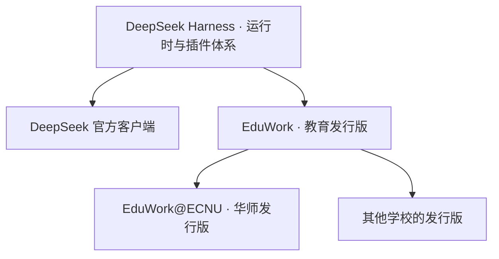

  

<h1 align="center">EduWork</h1>

<strong>基于 DSH 的教育发行版。</strong> 单点登录 · 插件与技能 · Knowledge Studio

 

**简体中文** | [English](README_EN.md)

[发行版关系](#从-dsh-到学校发行版) · [插件](#随包插件) · [技能](#随包技能) · [单点登录](#单点登录与开放模型接入) · [Studio](#knowledge-studio) · [开始使用](#安装与使用)

EduWork 是基于 [DeepSeek Harness（DSH）](https://github.com/deepseek-ai/deepseek-harness) 的教育发行版，为教学、科研与办公选配插件、技能和桌面运行环境。下载后即可围绕本机资料开展工作；接入学校或企业的模型服务后，用组织账号登录即可使用获授权的模型。

## 从 DSH 到学校发行版

借用 Linux 内核与发行版的关系来理解：**DSH 提供 Agent 运行时与插件体系，DeepSeek 官方客户端提供官方组合；EduWork 在同一基础上组织教育场景的插件、技能与配置，学校再按自己的服务扩展发行。**

EduWork 的重点是把教育工作需要的能力组合好：**开放的机构登录与模型接入、资料驱动的 Knowledge Studio，以及配套的创作、检索和学习技能。** 通用能力持续复用 DSH 的实现；学校服务通过配置和插件接入。[EduWork@ECNU](https://github.com/ECNU/EduWork-ECNU) 是在此基础上增加华东师范大学服务的发行版，其他学校可以直接基于 EduWork 维护自己的组合。

## 随包插件

插件提供可执行能力、服务连接和界面。教育发行版已选配以下主要插件，桌面用户无需逐个安装：

| 插件 | 带来的能力 | 使用条件 |
| --- | --- | --- |
| [机构登录与模型接入](packages/dsh-oidc/README.md) · `@eduwork/dsh-oidc` | 浏览器单点登录、模型发现、Token 刷新；支持 oidc-llm 草案和 LiteLLM 原生 OAuth。 | 配置兼容的机构或网关服务。 |
| [Knowledge Studio](packages/dsh-knowledge-studio/README.md) · `@eduwork/dsh-knowledge-studio` | 从工作区资料生成报告、思维导图、测验、闪卡、表格、演示文稿及音视频概览。 | 已连接模型；媒体成果按所需服务启用。 |
| [成果与媒体服务](packages/dsh-knowledge-studio/packages/artifact-services/README.md) · `@eduwork/dsh-artifact-services` | Office 文件生成与预览、语音和媒体制作，供对话与 Studio 共用。 | 使用随包本地资源或已配置的服务。 |
| [文献检索](third_party/dsh-literature/NOTICE.md) · `@shlv/dsh-literature` | 检索 DBLP、arXiv 文献，获取 BibTeX 和可用全文。 | 需要访问相应文献服务；来自社区项目。 |
| [本地记忆](packages/dsh-memory/README.md) · `@eduwork/dsh-memory` | 管理本地记忆、检索历史对话，延续任务背景。 | 在本机管理。 |
| [邮件助手](packages/dsh-mail/README.md) · `@eduwork/dsh-mail` | 读取 IMAP 邮件，经授权通过 SMTP 发送邮件。 | 连接邮箱并配置相应权限。 |
| [浏览器](dsh-plugins/tool-browser/README.md)与[媒体服务接入](dsh-plugins/media-openai/README.md) | 浏览网页；连接 OpenAI 兼容的图像生成、云端 TTS 服务。 | 网页需联网；云端媒体需另配服务。 |
| [技能管理](dsh-plugins/skill-settings-native/README.md)与[工作台设置](dsh-plugins/workbench-native/README.md) | 管理技能，提供历史导入、通知和更新设置等桌面能力。 | 随发行版提供。 |

**随包提供不等于所有外部服务都已开通。** 公版不包含学校账号、模型额度或私人凭据。完整组合见[发行清单](config/distributions/generic.json)；公共 npm 插件也可供匹配版本的其他 DSH 应用独立使用。

## 随包技能

技能（Skills）提供任务方法与操作指引，调用插件提供的工具。它们与插件分别管理，对话和 Studio 共用同一套创作能力。

| 技能 | 用途 |
| --- | --- |
| `artifact-documents` | 撰写、编辑 Word 文档。 |
| `artifact-presentations` | 组织内容并制作 PPT 演示文稿。 |
| `artifact-spreadsheets` | 整理数据、计算分析并生成电子表格。 |
| `artifact-pdfs` | 阅读、生成和检查 PDF。 |
| `artifact-images` | 通过已配置服务创作插图、海报等图像。 |
| `artifact-speech` | 查询可用音色、生成语音，按已就绪提供方转写音频。 |
| `artifact-video` | 编排并生成视频内容。 |
| `knowledge-studio` | 从资料创建并登记 Studio 成果。 |
| `browser` | 检索公开信息、阅读和操作网页。 |
| `skill-creator` | 创建与维护自己的技能。 |
| `eduwork-help` | 查找产品使用方法与排障说明。 |

你可以启停内置技能、导入个人技能，或为项目编写专用技能。复制技能只会增加操作指引；它依赖的模型、插件和服务仍需可用。

界面会随版本调整；插件提供能力，技能描述如何使用这些能力。

## 单点登录与开放模型接入

**用组织账号登录，即可使用获授权的模型；账号与模型服务不绑定某一个客户端。** EduWork 通过浏览器完成授权，自动发现模型、管理 Token 刷新。机构模型与个人 API Key 可以同时使用，权限与配额由服务端管理。

模型接入有两条路线：

| 路线 | 面向谁 | 当前状态 |
| --- | --- | --- |
| **oidc-llm 开放协议草案** | 学校、自建模型平台，以及希望支持多种客户端的网关。 | ChatECNU 已采用这条接入路线；EduWork 内置实验适配器，需显式启用。[草案](packages/dsh-oidc/docs/gateway-auth/oidc-llm-draft.md) · [已实现范围与配置](packages/dsh-oidc/docs/gateway-auth/experimental-oidc-llm.md) |
| **LiteLLM 原生 OAuth** | 已部署 LiteLLM 的组织。 | 直接兼容网关原生 CLI OAuth，使用其授权与模型目录，无需实现另一套协议。[接入指南](packages/dsh-oidc/docs/gateway-auth/litellm-setup.md) |

### 我们推动的开放接入方向

**oidc-llm 是我们面向机构与多客户端互通推进的协议草案。** 它在 OAuth/OIDC 的基础上约定服务发现、模型目录与 Access Token 模型调用，使学校能够开放自己的模型服务，而无需为每个客户端另做一套登录和发 Key 流程。其他客户端可以按协议独立实现，不必采用 EduWork 的界面或 DSH。

目前是 **0.1 草案与实验实现**，尚未成为正式标准，也不是 OpenID 官方标准。ChatECNU 的接入是落地示例；完整草案与客户端已实现范围分别记录，互通需按版本验证。草案中的 `oidc` / `oauth` 是同一协议下的身份模式。

插件还保留**纯身份 OIDC 登录**，用于只需要身份认证的场景；它不提供模型授权，因此不列为第三条模型接入路线。配额、计费和校内业务由各机构扩展，不作为通用登录协议的前提。

[开放接入倡议](packages/dsh-oidc/docs/open-integration.md) · [服务端接入契约](packages/dsh-oidc/docs/server-integration-contract.md) · [客户端插件](packages/dsh-oidc/README.md)

### 已有 LiteLLM 也能直接接入

配置完整的发现地址后，客户端完成浏览器授权、模型发现和 Token 刷新。服务端须启用原生 CLI OAuth 并为用户授权模型；版本要求见[接入指南](packages/dsh-oidc/docs/gateway-auth/litellm-setup.md)。我们也欢迎更多开源模型网关参与适配。

组织网关与个人配置的模型服务可以同时使用。

## Knowledge Studio

**受 NotebookLM 启发，把资料变成可以阅读、使用和练习的知识成果。** Knowledge Studio 直接使用本机工作区的资料与已配置的模型，与对话共享成果和文件预览能力。

### 从资料到创作

在对话中整理资料、探索问题，生成的文件可以直接预览，也可以作为 Studio 的素材。下面的例子先调研校园信息并生成 HTML 简介，再用这份资料制作测验。

对话和成果并排呈现：继续讨论，也能打开文件查看结果。

打开右侧 Studio，选择一种成果形式：

| 创作与整理 | 理解与学习 |
| --- | --- |
| 报告、数据表、演示文稿 | 思维导图、测验、闪卡 |
| 导出 DOCX、XLSX、PPTX | 浏览引用、答题、查看解析、继续追问 |

音频和视频概览提供另一种阅读资料的方式。文生图和云端 TTS 需配置兼容服务，本机语音取决于系统与本地资源，详见[媒体服务配置](docs/MEDIA.md)。

同一份资料可以用于不同成果；生成后从「最近成果」打开。

### 从阅读到学习

测验和闪卡支持直接交互。答题后查看反馈、解析与资料依据，遇到不理解的内容可以继续「问问 AI」。

从答案回到资料，再带着问题继续学习。

### Studio 本身也是插件

Knowledge Studio 以独立插件提供，通过宿主的侧栏插槽（slot）接入工作台，并提供成果能力注册接口。开发者可以扩展成果类型，也可以通过插件接入其他 Studio 界面。Office、语音和媒体生成服务独立维护，供对话与 Studio 复用。

我们希望这里能容纳更多创作与学习方式。新的 Studio 需要实现相应插件适配；目前提供的是 Knowledge Studio。详见 [Studio 架构与扩展接口](packages/dsh-knowledge-studio/docs/ARCHITECTURE.md)。

## 安装与使用

每位用户在自己的电脑上独立运行，无需部署额外的 EduWork 服务端；模型服务由你选择的服务商或机构提供。

桌面包支持 **Windows x64** 和 **macOS 15+ Apple Silicon（arm64）**。Windows 使用 Electron 绿色包，解压即可运行；Mac 开发包解压后将 `EduWork.app` 放入“应用程序”。Mac 尚未使用 Apple Developer ID 签名或公证，首次打开可能出现系统安全提示，详见 [macOS 说明](docs/MACOS.md)。

### 1. 获取客户端

从 [GitHub Releases](https://github.com/ecnu/EduWork/releases) 选择对应平台的完整桌面包：

- **Windows x64**：解压到可写目录，运行 `EduWork-Electron.exe`。请保留同目录下的资源文件，不要只复制 EXE。
- **macOS arm64**：解压后将 `EduWork.app` 放入“应用程序”，然后打开；配置和用户数据存放在用户目录。

GitHub 的 Source code 压缩包不是桌面安装包。从源码运行见[构建指南](docs/BUILD.md)。

### 2. 连接模型

| 你已有的服务 | 如何连接 |
| --- | --- |
| 个人模型 API | 打开 **设置 → 模型**，填写服务商的 API Key、接口地址和模型。 |
| LiteLLM 网关账号 | 按下方步骤配置发现地址，通过浏览器登录，无需手动填写模型 Key。 |
| 学校或企业提供的配置 | 按[机构配置方法](#配置方法)合并到生效配置，再选择机构登录。 |

公版默认不自动下载机构配置，安装包自带带注释的 `eduwork.jsonc` 和 `examples/`。机构接入、媒体服务、插件默认值与更新源等应用配置集中在设置中打开的这一份文件，可选配置项列在文件末尾的注释参考中。个人模型、API Key 和界面偏好仍在对应设置界面中管理。

#### 连接 LiteLLM

1. 从 **设置 → 打开配置文件** 打开生效的 `eduwork.jsonc`，参照旁边的 `examples/litellm.jsonc`，把机构条目加入 `organizations` 数组。
2. 填写显示名称、本机唯一 `id`、完整发现地址（例如 `https://gateway.example.org/.well-known/litellm-cli-auth`）以及发现文档里的 `issuer`。LiteLLM 自动注册 Client ID，**不需要填写 `clientId`、`client_secret` 或 API Key**。
3. 保存后完全退出并重启，从账户入口登录 LiteLLM；按网关提示选择团队并授权，再选择模型开始对话。

服务端需启用 LiteLLM 原生 CLI OAuth，并提供有模型权限的账号。HTTP 测试环境还需把机构对象中的 `allowInsecureDevelopment` 改为 `true`，HTTPS 保持默认 `false`。字段填写见[逐项配置说明](config/desktop/examples/README.md#接入-litellm改哪里填什么)，版本要求与部署检查见[LiteLLM 接入指南](packages/dsh-oidc/docs/gateway-auth/litellm-setup.md)。

使用学校或企业提供的配置

1. 在设置中点击 **打开配置文件**，编辑当前生效的 `eduwork.jsonc`。Windows 位于程序目录的 `config/`；macOS 位于 `~/Library/Application Support/eduwork-electron/config/`。
2. 按服务端指南选择旁边 `examples/` 中的示例，将机构条目加入 `organizations`，保留已有配置；需要图像或语音服务时再加入 `media`。只修改示例文件不会生效。
3. 保存后从托盘或应用菜单完全退出并重新启动，再选择机构登录。

配置文件只保存公开接入信息和凭据引用。个人 API Key 在模型设置中管理，登录 Token 保存在本机受保护存储中；不要把密码或令牌写入配置文件。界面 Logo 可配置，程序内嵌图标由发行包提供。

[LiteLLM 示例](config/desktop/examples/litellm.jsonc) · [实验性 oidc-llm 示例](config/desktop/examples/organization.jsonc) · [媒体示例](config/desktop/examples/media.jsonc)

### 3. 开始工作

选择一个本机工作区，放入任务资料，直接描述你想得到的结果。需要文档、表格等成果时，也可以打开右侧 Studio，选择对应类型开始。

可以先试试：**“根据这些资料生成一份学习指南，再制作配套测验。”**

窗口行为与自动更新

窗口关闭后默认收起到系统托盘；需要完全退出时，使用托盘或应用菜单。公版默认从 GitHub 获取更新，公测与开发渠道可在设置中选择。Windows 使用绿色版更新器；macOS 使用 Sparkle，按提示确认下载和安装后替换应用并重启。机构可配置自己的更新源，更新保留历史数据与用户配置。详见 [Windows 更新说明](docs/UPDATES.md)和 [macOS 更新说明](docs/MACOS_UPDATES.md)。

## 扩展与贡献

学校可以从 EduWork 的教育发行组合出发，增加自己的身份与模型配置、校内服务插件、教学科研技能、品牌和更新渠道。**通用改进回到公版，学校专属能力留在自己的发行版。** [EduWork@ECNU](https://github.com/ECNU/EduWork-ECNU) 展示了这种组合方式。

只需连接已有模型服务时，提供配置即可；需要校内检索、配额等额外能力时，再追加插件与技能。Studio 也通过插槽接入，可以扩展成果类型或实现其他 Studio，而无需维护第二份工作台。

欢迎贡献插件、技能、网关适配与 Studio 实现，也欢迎参与 oidc-llm 草案讨论。[贡献指南](CONTRIBUTING.md) · [讨论与反馈](https://github.com/ECNU/EduWork/issues) · [机构发行边界](docs/EDITIONS.md) · [插件包维护](docs/PACKAGES.md)

## 详细文档

| 文档 | 内容 |
| --- | --- |
| [使用指南](docs/USER_GUIDE.md) | 模型、搜索、语音、文件操作与故障诊断。 |
| [配置文件](docs/CONFIGURATION.md) · [配置示例](config/desktop/examples/README.md) | 企业登录、品牌、媒体服务、更新源与并发设置。 |
| [LiteLLM 接入指南](packages/dsh-oidc/docs/gateway-auth/litellm-setup.md) | 服务端准备、客户端配置、登录及故障排查。 |
| [Knowledge Studio](packages/dsh-knowledge-studio/README.md) | 成果类型、使用方式与扩展开发。 |
| [媒体服务配置](docs/MEDIA.md) | 文生图、云端 TTS 的接口要求及配置方法。 |
| [版本与升级](docs/RELEASE.md) · [更新源部署](docs/UPDATES.md) | 开发版与公测版、数据迁移和自动更新。 |
| [配置与 Skills 更新](docs/CONTENT_UPDATES.md) | 管理员按需独立更新模型配置和官方技能，无需重新下载客户端。 |
| [构建指南](docs/BUILD.md) · [macOS 说明](docs/MACOS.md) | 从源码运行、桌面装配与平台适配。 |
| [贡献指南](CONTRIBUTING.md) · [发行边界](docs/EDITIONS.md) | 参与开发及公版与机构扩展的分工。 |

## 数据与隐私

会话、工作区引用和记忆在本机管理。连接远程模型、搜索或媒体服务时，执行任务所需的内容会发送给相应服务商；数据处理规则以所选服务为准。截图使用演示资料，其中的生成内容不作为事实参考。

跨机使用可通过设置中的[历史数据导入](docs/数据导入.md)功能合并会话和客户端目录内的资料；客户端目录之外的工作区文件需要另行复制。故障排查可导出诊断 ZIP，具体会话问题可另外提供 Session log，详见[使用指南](docs/USER_GUIDE.md)。

## 致谢与许可

EduWork 基于 [DeepSeek Harness](https://github.com/deepseek-ai/deepseek-harness) 构建，感谢其提供的 Agent 运行时与插件基础。Knowledge Studio 的资料创作与学习交互受 NotebookLM 启发。

EduWork 项目代码采用 [MIT 许可证](LICENSE)。第三方组件保留各自的许可证，详见[第三方声明](THIRD_PARTY_NOTICES.md)。
