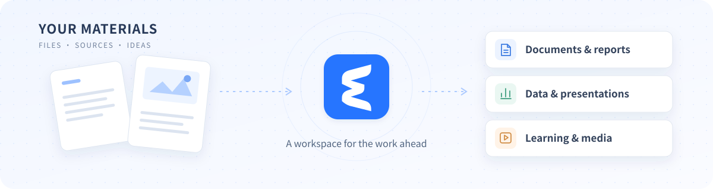
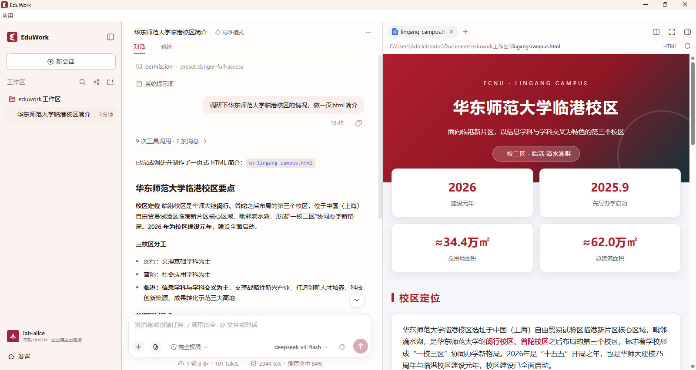
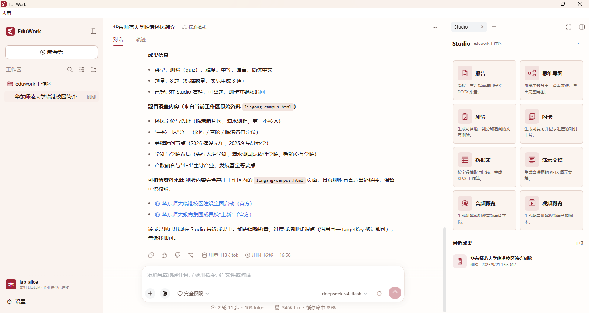
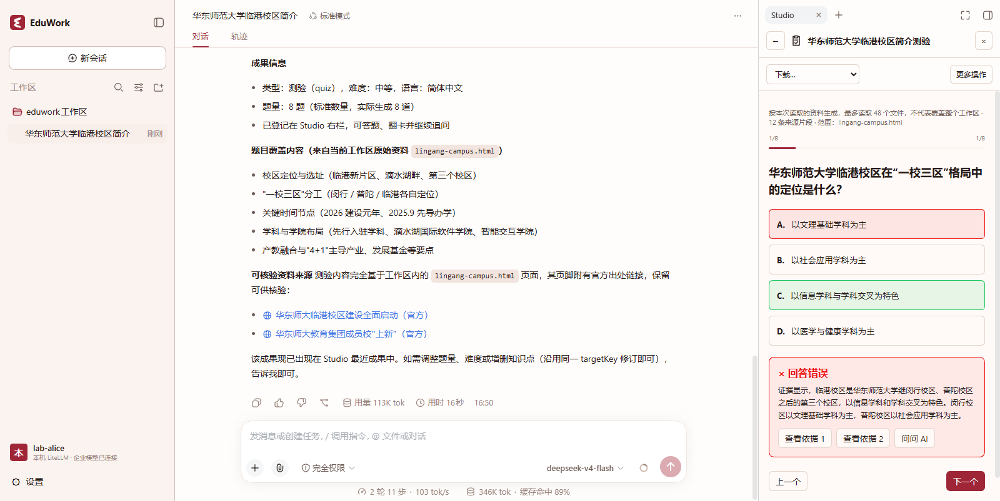
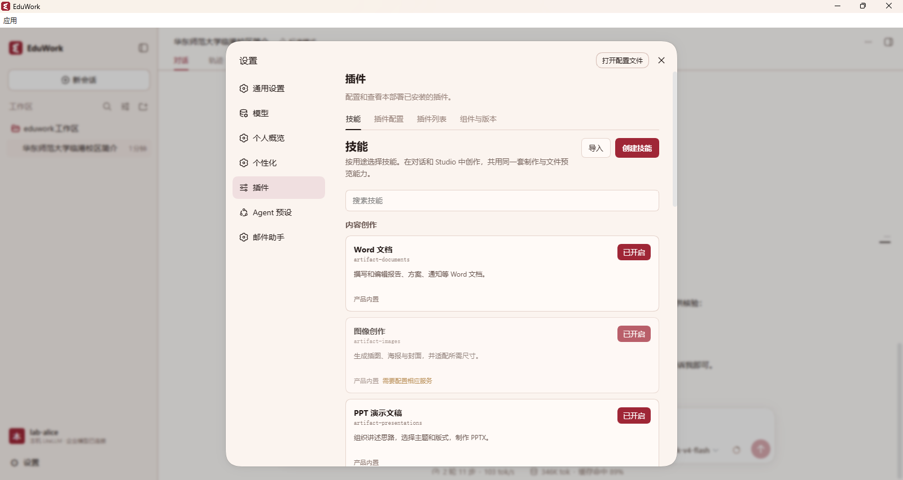
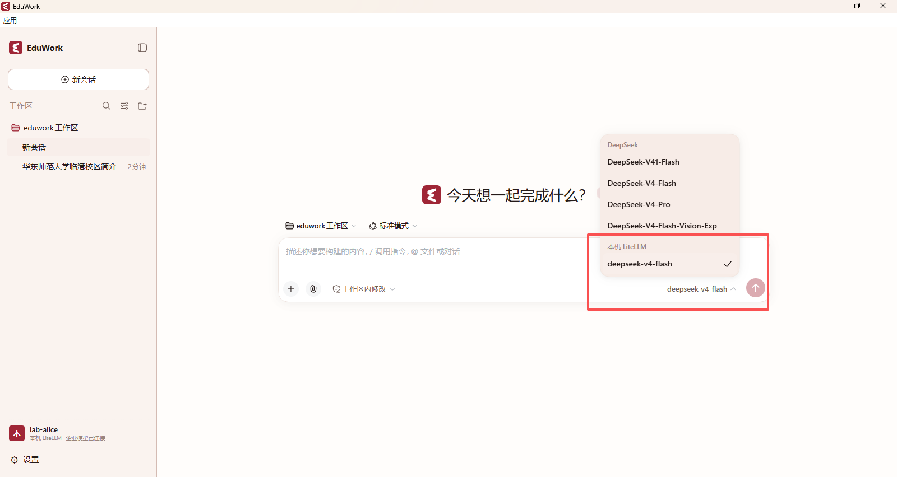

  

<h1 align="center">EduWork</h1>

<strong>Turn your materials into finished work, with AI.</strong> Local workspaces · Useful outputs · Your models and institutional services

   

[简体中文](README.md) | **English**

[Get started](#installation-and-use) · [Connect LiteLLM](#connect-litellm) · [School and enterprise integration](#school-and-enterprise-integration) · [Open integration initiative](#one-integration-more-clients) · [User guide](docs/USER_GUIDE.md)

EduWork is a desktop AI assistant built on [DeepSeek Harness](https://github.com/deepseek-ai/deepseek-harness). Choose a folder and describe what you want to accomplish: read sources, search for information, analyze data, and create documents, spreadsheets, and presentations in one workspace.

Individuals can connect their own model APIs. Schools and businesses can configure their identity and model services. **Each client runs independently on its user's computer, with no separate EduWork server to deploy.**

From research to a finished page: continue the conversation on the left and preview the generated result on the right.

## What you can do

<table>
<tr>
<td width="50%" valign="top"><h3>Work with your files</h3>
Read sources, edit documents, analyze data, and run scripts in a local workspace.
</td>
<td width="50%" valign="top"><h3>Create useful outputs</h3>
Use Studio to turn ideas into reports, spreadsheets, presentations, and learning materials.
</td>
</tr>
<tr>
<td width="50%" valign="top"><h3>Choose your models</h3>
Connect your own APIs or sign in to an organization. Personal and enterprise models can coexist.
</td>
<td width="50%" valign="top"><h3>Bring your services</h3>
Configure identity and model access, then add skills and plugins for specialized work.
</td>
</tr>
</table>

### Start with a real task

| What you are working on | Try asking EduWork |
| --- | --- |
| Teaching and learning | “Create a presentation from these course materials, then make a quiz and revision flashcards.” |
| Research and discovery | “Read these sources, organize findings by topic, cite the evidence, and flag questions to verify.” |
| Data and everyday work | “Compare these spreadsheets, identify differences, and create an analysis report and summary table.” |

The agent can read and edit files, run scripts, and coordinate subagents for complex tasks. Conversations and outputs stay with your workspace, ready for revisions, new sources, and follow-up work.

### Make the results in Studio

Open Studio on the right and choose an output type, or ask for it in a conversation. Both entry points share generation, previews, and downloads.

**Reports · Spreadsheets · Presentations · Mind maps · Quizzes · Flashcards · Audio · Video**

Choose an output type to begin. Generated items appear under Recent results, ready to open and use.

Export reports, spreadsheets, and presentations as **DOCX, XLSX, and PPTX** files. Preview interactive learning materials and download media with subtitles. Image generation and cloud TTS require compatible services; local speech depends on the system and local resources. See [media configuration](docs/MEDIA.md).

See how a generated quiz works

Answer directly in the sidebar, review explanations and source evidence, and use Ask AI for follow-up questions.

### Make it work your way

- **Search and browser**: use official DeepSeek search when its key is configured, or browser search without a key otherwise.
- **Skill center**: browse built-in skills, import skills, or write task guidance of your own without rebuilding the client.
- **Memory and mail**: keep task context with local memory; configure an email account to work with the mail assistant.
- **Speech, models, and preferences**: use local transcription and system speech synthesis, choose your models, switch between blue and red themes, and set a total limit for concurrent model requests.

Explore the skill center

Skills provide task guidance; plugins provide executable capabilities. Supported identity, model, and media services connect through configuration.

## Installation and use

Desktop packages support **Windows x64** and **macOS 15+ on Apple Silicon (arm64)**. Extract the portable Windows package to run it; on Mac, extract the development package and move `EduWork.app` to Applications. Mac packages do not yet have Apple Developer ID signing or notarization, so the first launch may show a system security prompt. See the [macOS notes](docs/MACOS.md).

### 1. Get the client

Download the complete desktop package for your platform from [GitHub Releases](https://github.com/ecnu/EduWork/releases):

- **Windows x64:** extract into a writable directory and run `EduWork-Electron.exe`. Keep the accompanying resource files; do not copy just the EXE.
- **macOS arm64:** extract and move `EduWork.app` to Applications, then open it. Configuration and user data live in the user directory.

GitHub's Source code archives are not desktop packages. See the [build guide](docs/BUILD.md) to run from source.

### 2. Connect a model

| What you have | How to connect |
| --- | --- |
| Personal model API | Open **Settings → Models** and enter your provider's API key, endpoint, and model. |
| LiteLLM gateway account | Configure discovery as described below and sign in through the browser, without manually entering a model key. |
| School or company configuration | Merge it into the active file using the [organization steps](#configuration-steps), then sign in. |

The public edition does not download institution configuration by default. It ships a commented `eduwork.jsonc` and an `examples/` folder. All user configuration lives in the single file opened from Settings; optional fields are documented in a commented reference at its end.

#### Connect LiteLLM

1. Open the active `eduwork.jsonc` through **Settings → Open configuration file**. Use the adjacent `examples/litellm.jsonc` to add an organization to the `organizations` array.
2. Set its display name, unique local `id`, complete discovery URL (such as `https://gateway.example.org/.well-known/litellm-cli-auth`), and the `issuer` from discovery. LiteLLM registers its Client ID automatically: **do not enter `clientId`, `client_secret`, or an API Key**.
3. Save, completely exit, and restart. Sign in to LiteLLM from the account menu, choose a team if requested, approve access, and select a model to chat.

The gateway must enable native CLI OAuth and grant the account model permissions. The protocol baseline is LiteLLM v1.101.0 / native contract 1. For HTTP testing, set `allowInsecureDevelopment` to `true` in the organization object; keep its default `false` for HTTPS. See the [field-by-field steps](config/desktop/examples/README_EN.md#connect-litellm-where-to-edit-and-what-to-enter) and [server preparation and troubleshooting](packages/dsh-oidc/docs/gateway-auth/litellm-setup.en.md).

See model selection after LiteLLM sign-in

This example account is authorized to use `deepseek-v4-flash`; your gateway determines the actual names and model list. The DeepSeek group above is a separately configured provider, which can coexist with organization models.

### 3. Start working

Choose a local workspace, add your task materials, and describe the result you want. For documents, spreadsheets, and other outputs, you can also open Studio on the right and choose an output type.

Window behavior and updates

Closing the window minimizes it to the system tray by default. Use the tray menu to exit completely. The Windows public edition defaults to GitHub updates, with public-beta and development channels selectable in Settings; institutions can configure another source. Updates preserve history and user configuration; see the [update guide](docs/UPDATES.md).

## School and enterprise integration

**Enterprise integration is built into the public edition.** Schools and businesses can distribute a configuration file that connects the same EduWork client to their identity platform, model gateway, and media services, without changing the public code or rebuilding the client.

### Servers supporting enterprise sign-in

| Server / project | Sign-in and model access | Setup and usage |
| --- | --- | --- |
| [LiteLLM](https://github.com/BerriAI/litellm) | Sign in to the gateway and access models authorized for the user and selected team. | [LiteLLM setup guide](packages/dsh-oidc/docs/gateway-auth/litellm-setup.en.md) |
| [ChatECNU](https://developer.ecnu.edu.cn/vitepress/llm/model.html) | Connect institution identity and authorized models through oidc-llm. | [EduWork@ECNU institutional edition example](https://github.com/ECNU/EduWork-ECNU) |

**EduWork 0.3.6-dev.20260921.1 includes these Token model-access capabilities.** oidc-llm remains experimental and requires explicit opt-in according to the server contract; standard LiteLLM configuration does not enable that option.

After enterprise sign-in, the client uses the login Token to discover and invoke models, refreshing it automatically during use. Users do not need to copy or create a separate model key. The server continues to manage model permissions and quotas; enterprise and personally configured models can coexist.

Other standard OIDC platforms can provide identity sign-in. Organization models additionally require a supported Token model-access contract. Organizations can also configure image generation, cloud TTS, names, logos, and update sources.

<strong>Configure your organization in three steps</strong>

1. Select **Open configuration file** in Settings. The active `eduwork.jsonc` is under the application directory's `config/` on Windows, or `~/Library/Application Support/eduwork-electron/config/` on macOS.
2. Follow the server guide and the adjacent `examples/` folder. Add organization entries to `organizations`, preserving existing settings; add `media` if needed. Editing the example alone has no effect.
3. Save, exit completely through the tray or application menu, and restart. Then select your organization and sign in.

Configuration files contain public connection details and credential references. Manage personal API keys in model settings; login Tokens are kept in protected local storage. Do not put passwords or tokens in the configuration file. The interface logo is configurable; the embedded application icon comes from the distribution.

**Administrator configuration:** [LiteLLM example](config/desktop/examples/litellm.jsonc) · [Experimental oidc-llm example](config/desktop/examples/organization.jsonc) · [Media example](config/desktop/examples/media.jsonc).

**Developer integration:**

- [Server implementation and integration testing](packages/dsh-oidc/docs/server-integration-contract.en.md): endpoints, authentication requirements, and acceptance steps for the LiteLLM native and experimental oidc-llm contracts.
- [Client integration modes and model discovery](packages/dsh-oidc/docs/public-resource-protocol.en.md): identity-only and Token model modes, authorized catalogs, model capabilities, and plugin integration through the shared Host.

### Add internal services with plugins

Schools and businesses can use plugins to connect internal systems, bringing organization-specific search, business tools, or account services into EduWork. Plugins provide executable capabilities; skills provide task-specific guidance. Existing identity, model, and media APIs should use configuration where supported.

Organizations can combine plugins, skills, and default configuration into their own edition while reusing EduWork's workbench, Studio, file previews, and desktop capabilities. Shared features continue to be maintained in the public edition, while each organization maintains its extensions.

[EduWork@ECNU](https://github.com/ecnu/EduWork-ECNU) is an example of an institutional extension, showing how East China Normal University connects its internal services to the public edition. Use that repository as a reference for organizing extensions and distribution configuration; see [edition boundaries](docs/EDITIONS.md) for the design.

## One integration, more clients

> **Let institutional accounts and model services work across more AI clients.**

Through the **Open Identity and Model Integration Initiative**, we invite identity platforms, model gateways, and client developers to make sign-in, model credentials, and model catalogs reusable through open protocols.

`dsh-oidc` is our starting implementation: standard OIDC identity sign-in, the LiteLLM native OAuth contract, and the experimental oidc-llm contract, sharing Token sessions and model invocation modules. Source, protocol documents, and configuration examples are public, and the module is maintained as an independent npm package. Other clients can implement the protocols without adopting EduWork's UI. This is a community proposal; interoperability needs version-specific testing.

**[Read the initiative](packages/dsh-oidc/docs/open-integration.en.md)** · [Implement a server](packages/dsh-oidc/docs/server-integration-contract.en.md) · [Integrate a client](packages/dsh-oidc/README_EN.md) · [Share feedback](https://github.com/ecnu/EduWork/issues)

## Data and privacy

Conversations, workspace references, and memory are managed locally. When using remote models, search, or media services, content needed for a task is sent to the corresponding provider and is subject to that provider's data policies.

When moving between computers, use [history import](docs/数据导入.md) in Settings to merge conversations and materials inside the client directory. Workspace files outside that directory must be copied separately. For troubleshooting, export a diagnostic ZIP and, for a particular conversation, a separate Session log. See the [user guide](docs/USER_GUIDE.md).

## Documentation

| Guide | Contents |
| --- | --- |
| [User guide](docs/USER_GUIDE.md) | Models, search, speech, file operations, and diagnostics. |
| [Configuration file](docs/CONFIGURATION_EN.md) · [Configuration examples](config/desktop/examples/README_EN.md) | Enterprise sign-in, branding, media, updates, and concurrency. |
| [LiteLLM setup guide](packages/dsh-oidc/docs/gateway-auth/litellm-setup.en.md) | Server preparation, client configuration, sign-in, and troubleshooting. |
| [Media configuration](docs/MEDIA.md) | Endpoint requirements and setup for image generation and cloud TTS. |
| [Versioning and upgrades](docs/RELEASE.md) · [Update sources](docs/UPDATES.md) | Development and public-beta builds, data migration, and automatic updates. |
| [Configuration and Skills updates](docs/CONTENT_UPDATES_EN.md) | Optional independent model configuration and official Skills updates without downloading the whole client. |
| [Build guide](docs/BUILD.md) · [macOS notes](docs/MACOS.md) | Running from source, desktop packaging, and platform support. |
| [Contribution guide](CONTRIBUTING.md) · [Edition boundaries](docs/EDITIONS.md) | Contributing and the division between the public edition and institutional extensions. |

Detailed documentation defaults to Chinese.

### Public modules

These modules keep their source and documentation in this repository. Each npm package can still be installed, versioned, and published independently, including for use in other DSH applications.

| Module documentation | Capabilities |
| --- | --- |
| [Identity and models (dsh-oidc)](packages/dsh-oidc/README_EN.md) | OIDC / OAuth sign-in, Token model authorization, enterprise model catalogs, and server integration protocols. |
| [Local memory (dsh-memory)](packages/dsh-memory/README_EN.md) | Local memory and history retrieval to carry task context forward. |
| [Mail assistant (dsh-mail)](packages/dsh-mail/README_EN.md) | Read mail through IMAP, send through SMTP, and manage the associated permissions. |
| [Studio (dsh-knowledge-studio)](packages/dsh-knowledge-studio/README_EN.md) | Create, preview, and manage reports, spreadsheets, presentations, learning materials, and media. |
| [Artifact and media services (dsh-artifact-services)](packages/dsh-knowledge-studio/packages/artifact-services/README_EN.md) | Office, speech, image, and media generation shared by conversations and Studio. |

See [package development and publication](docs/PACKAGES_EN.md) for module development, checks, and npm releases.

## Acknowledgments and license

Thanks to [DeepSeek Harness](https://github.com/deepseek-ai/deepseek-harness) and its open-source ecosystem for the foundations of EduWork.

EduWork project code uses the [MIT License](LICENSE). Third-party components retain their own licenses; see the [third-party notices](THIRD_PARTY_NOTICES.md).
