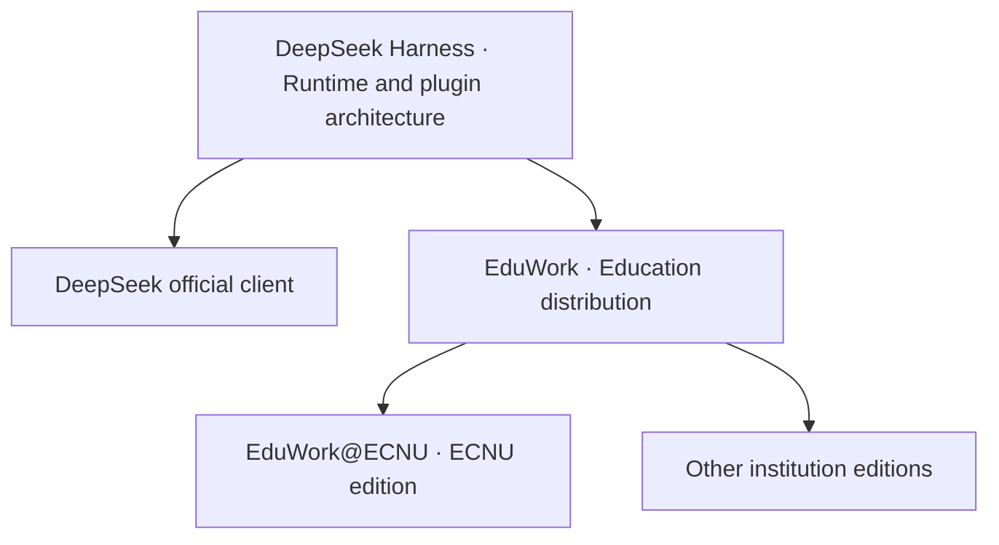

  

<h1 align="center">EduWork</h1>

<strong>An education distribution built on DSH.</strong> SSO · Plugins and skills · Knowledge Studio

 

[简体中文](README.md) | **English**

[Editions](#from-dsh-to-institution-editions) · [Plugins](#bundled-plugins) · [Skills](#bundled-skills) · [SSO](#sso-and-open-model-access) · [Studio](#knowledge-studio) · [Get started](#installation-and-use)

EduWork is an education-focused distribution built on [DeepSeek Harness (DSH)](https://github.com/deepseek-ai/deepseek-harness). It brings together plugins, skills, and a desktop environment for teaching, research, and administrative work. Work with local materials, then connect your institution's model service to use authorized models with your organization account.

## From DSH to institution editions

The Linux kernel and distribution relationship is a useful analogy: **DSH provides the agent runtime and plugin architecture; DeepSeek's official client provides the official combination. EduWork assembles plugins, skills, and configuration for education, and institutions extend it with their own services.**

EduWork focuses on a useful combination for education: **open institutional sign-in and model access, source-based Knowledge Studio, and skills for creation, research, and learning.** Shared capabilities continue to reuse DSH implementations; institution services connect through configuration and plugins. [EduWork@ECNU](https://github.com/ECNU/EduWork-ECNU) adds East China Normal University services. Other institutions can build their own combinations directly on EduWork.

## Bundled plugins

Plugins provide executable capabilities, service connections, and interfaces. The education distribution includes these main plugins, without requiring desktop users to install each separately:

| Plugin | Capabilities | Requirements |
| --- | --- | --- |
| [Institutional sign-in and models](packages/dsh-oidc/README_EN.md) · `@eduwork/dsh-oidc` | Browser-based SSO, model discovery, and Token refresh; supports the oidc-llm draft and native LiteLLM OAuth. | A compatible institution or gateway service. |
| [Knowledge Studio](packages/dsh-knowledge-studio/README_EN.md) · `@eduwork/dsh-knowledge-studio` | Reports, mind maps, quizzes, flashcards, spreadsheets, presentations, and audio/video overviews from workspace materials. | A connected model; media outputs need their corresponding services. |
| [Artifact and media services](packages/dsh-knowledge-studio/packages/artifact-services/README_EN.md) · `@eduwork/dsh-artifact-services` | Office generation and previews, speech, and media production shared by conversations and Studio. | Bundled local resources or configured services. |
| [Literature search](third_party/dsh-literature/NOTICE.md) · `@shlv/dsh-literature` | Search DBLP and arXiv, retrieve BibTeX and available full text. | Access to the literature services; contributed by a community project. |
| [Local memory](packages/dsh-memory/README_EN.md) · `@eduwork/dsh-memory` | Manage local memory and retrieve earlier conversations to carry context forward. | Managed locally. |
| [Mail assistant](packages/dsh-mail/README_EN.md) · `@eduwork/dsh-mail` | Read IMAP mail and send through SMTP with authorization. | A connected mailbox and appropriate permissions. |
| [Browser](dsh-plugins/tool-browser/README_EN.md) and [media integration](dsh-plugins/media-openai/README_EN.md) | Browse web pages; connect OpenAI-compatible image generation and cloud TTS. | Web access; separately configured cloud media services. |
| [Skill management](dsh-plugins/skill-settings-native/README_EN.md) and [workbench settings](dsh-plugins/workbench-native/README_EN.md) | Manage skills, import history, and configure notifications and updates. | Included with the distribution. |

**Bundled does not mean every external service is already connected.** The public edition contains no institution accounts, model allowances, or private credentials. See the [distribution manifest](config/distributions/generic.json) for the full combination. Public npm plugins can also be used independently in other DSH applications with compatible versions.

## Bundled skills

Skills describe task methods and workflows, using tools supplied by plugins. They are managed separately from plugins; conversations and Studio share the same creation capabilities.

| Skill | Purpose |
| --- | --- |
| `artifact-documents` | Write and edit Word documents. |
| `artifact-presentations` | Organize content and create PowerPoint presentations. |
| `artifact-spreadsheets` | Organize data, perform analysis, and create spreadsheets. |
| `artifact-pdfs` | Read, generate, and inspect PDFs. |
| `artifact-images` | Create illustrations, posters, and other images through configured services. |
| `artifact-speech` | Discover voices, synthesize speech, and transcribe audio through available providers. |
| `artifact-video` | Plan and generate video content. |
| `knowledge-studio` | Create and register Studio artifacts from source materials. |
| `browser` | Search public information, read pages, and interact with websites. |
| `skill-creator` | Create and maintain your own skills. |
| `eduwork-help` | Find product guidance and troubleshooting instructions. |

Enable or disable bundled skills, import personal skills, or write project-specific ones. Copying a skill adds instructions; the models, plugins, and services it uses must still be available.

The interface evolves between versions. Plugins provide capabilities; skills describe how to use them.

## SSO and open model access

**Sign in with an organization account to use authorized models, without tying the account or service to one client.** EduWork authorizes through the browser, discovers models, and manages Token refresh. Organization models and personal API keys can coexist; the server manages permissions and quotas.

There are two model-access routes:

| Route | Who it serves | Current status |
| --- | --- | --- |
| **oidc-llm open protocol draft** | Institutions, self-hosted model platforms, and gateways serving multiple clients. | ChatECNU uses this route. EduWork includes an experimental adapter requiring explicit opt-in. [Draft](packages/dsh-oidc/docs/gateway-auth/oidc-llm-draft.en.md) · [Implemented scope and configuration](packages/dsh-oidc/docs/gateway-auth/experimental-oidc-llm.en.md) |
| **Native LiteLLM OAuth** | Organizations already running LiteLLM. | Connect directly to native CLI OAuth and the gateway's authorization and model catalog, without implementing another protocol. [Setup guide](packages/dsh-oidc/docs/gateway-auth/litellm-setup.en.md) |

### The open integration direction we are advancing

**oidc-llm is the protocol draft we are advancing for institutions and interoperability across clients.** Building on OAuth/OIDC, it specifies service discovery, model catalogs, and Access Token model invocation. Institutions can expose model access without building a separate sign-in and key-distribution flow for every client. Other clients can implement the protocol independently of EduWork's interface or DSH.

It remains a **0.1 draft with an experimental implementation**, not a finalized standard or an official OpenID standard. ChatECNU is an adoption example. The full draft and the client's implemented scope are documented separately; interoperability must be verified for the versions involved. The draft's `oidc` and `oauth` options are identity modes within the same protocol.

The plugin also retains **identity-only OIDC sign-in** for authentication without model authorization. This is not a third model-access route. Quota, billing, and campus business services remain institutional extensions, rather than requirements of the shared sign-in protocol.

[Open integration initiative](packages/dsh-oidc/docs/open-integration.en.md) · [Server integration contract](packages/dsh-oidc/docs/server-integration-contract.en.md) · [Client plugin](packages/dsh-oidc/README_EN.md)

### Connect an existing LiteLLM gateway

Configure the complete discovery URL, and the client handles browser authorization, model discovery, and Token refresh. The server must enable native CLI OAuth and authorize models for the user. See the [setup guide](packages/dsh-oidc/docs/gateway-auth/litellm-setup.en.md) for version requirements. Adapters for more open-source model gateways are welcome.

Organization gateways and personally configured model services can coexist.

## Knowledge Studio

**Inspired by NotebookLM, turn source materials into knowledge you can read, use, and practice.** Knowledge Studio uses the files in your local workspace and your configured models, sharing artifacts and file previews with conversations.

### From sources to creation

Organize materials and explore questions in a conversation. Preview the files you create and use them as sources in Studio. The example below starts with campus research and an HTML introduction, then turns that material into a quiz.

Conversation and output side by side: keep discussing while inspecting the resulting file.

Open Studio on the right and choose an output:

| Create and organize | Understand and learn |
| --- | --- |
| Reports, spreadsheets, presentations | Mind maps, quizzes, flashcards |
| Export DOCX, XLSX, PPTX | Explore citations, answer questions, review explanations, ask follow-ups |

Audio and video overviews offer another way to explore sources. Image generation and cloud TTS require compatible services; local speech depends on the system and local resources. See [media configuration](docs/MEDIA.md).

Use the same sources for different outputs, then open them from Recent results.

### From reading to learning

Quizzes and flashcards are interactive. Answer questions, review feedback and source evidence, and use Ask AI to follow up on anything you do not understand.

Return to the source behind an answer, then continue learning with new questions.

### Studio is a plugin, too

Knowledge Studio is an independent plugin. It connects to the workbench through the host's sidebar slots and provides a capability registration interface. Developers can extend output types or integrate other Studio interfaces through plugins. Office, speech, and media generation services are maintained separately for reuse by conversations and Studio.

We want this space to support more ways to create and learn. Additional Studios need a plugin adapter; Knowledge Studio is the implementation available today. See the [Studio architecture and extension interfaces](packages/dsh-knowledge-studio/docs/ARCHITECTURE.md).

## Installation and use

Each client runs independently on its user's computer, without a separate EduWork server. Model services come from your chosen provider or organization.

Desktop packages support **Windows x64** and **macOS 15+ on Apple Silicon (arm64)**. Extract the portable Windows package to run it; on Mac, extract the development package and move `EduWork.app` to Applications. Mac packages do not yet have Apple Developer ID signing or notarization, so the first launch may show a system security prompt. See the [macOS notes](docs/MACOS.md).

### 1. Get the client

Download the complete desktop package for your platform from [GitHub Releases](https://github.com/ecnu/EduWork/releases):

- **Windows x64:** extract into a writable directory and run `EduWork-Electron.exe`. Keep the accompanying resource files; do not copy just the EXE.
- **macOS arm64:** extract and move `EduWork.app` to Applications, then open it. Configuration and user data live in the user directory.

GitHub's Source code archives are not desktop packages. See the [build guide](docs/BUILD.md) to run from source.

### 2. Connect a model

| What you have | How to connect |
| --- | --- |
| Personal model API | Open **Settings → Models** and enter your provider's API key, endpoint, and model. |
| LiteLLM gateway account | Configure discovery as described below and sign in through the browser, without manually entering a model key. |
| School or company configuration | Merge it into the active file using the [organization steps](#configuration-steps), then sign in. |

The public edition does not download institution configuration by default. It ships a commented `eduwork.jsonc` and an `examples/` folder. Application configuration such as institution connections, media services, plugin defaults, and update sources lives in the single file opened from Settings; optional fields are documented in a commented reference at its end. Personal models, API keys, and interface preferences remain managed in their respective settings screens.

#### Connect LiteLLM

1. Open the active `eduwork.jsonc` through **Settings → Open configuration file**. Use the adjacent `examples/litellm.jsonc` to add an organization to the `organizations` array.
2. Set its display name, unique local `id`, complete discovery URL (such as `https://gateway.example.org/.well-known/litellm-cli-auth`), and the `issuer` from discovery. LiteLLM registers its Client ID automatically: **do not enter `clientId`, `client_secret`, or an API Key**.
3. Save, completely exit, and restart. Sign in to LiteLLM from the account menu, choose a team if requested, approve access, and select a model to chat.

The gateway must enable native CLI OAuth and grant the account model permissions. For HTTP testing, set `allowInsecureDevelopment` to `true` in the organization object; keep its default `false` for HTTPS. See the [field-by-field steps](config/desktop/examples/README_EN.md#connect-litellm-where-to-edit-and-what-to-enter), and the [LiteLLM setup guide](packages/dsh-oidc/docs/gateway-auth/litellm-setup.en.md) for version requirements and deployment checks.

Use a school or enterprise configuration

1. Select **Open configuration file** in Settings. The active `eduwork.jsonc` is under the application directory's `config/` on Windows, or `~/Library/Application Support/eduwork-electron/config/` on macOS.
2. Follow the server guide and the adjacent `examples/` folder. Add organization entries to `organizations`, preserving existing settings; add `media` if needed. Editing the example alone has no effect.
3. Save, exit completely through the tray or application menu, and restart. Then select your organization and sign in.

Configuration files contain public connection details and credential references. Manage personal API keys in model settings; login Tokens are kept in protected local storage. Do not put passwords or tokens in the configuration file. The interface logo is configurable; the embedded application icon comes from the distribution.

[LiteLLM example](config/desktop/examples/litellm.jsonc) · [Experimental oidc-llm example](config/desktop/examples/organization.jsonc) · [Media example](config/desktop/examples/media.jsonc)

### 3. Start working

Choose a local workspace, add your task materials, and describe the result you want. For documents, spreadsheets, and other outputs, you can also open Studio on the right and choose an output type.

Try: **“Create a study guide from these sources, then make a companion quiz.”**

Window behavior and updates

Closing the window minimizes it to the system tray by default. Use the tray or application menu to exit completely. The public edition defaults to GitHub updates, with public-beta and development channels selectable in Settings. Windows uses its portable updater; macOS uses Sparkle to download, replace the application, and restart after user confirmation. Institutions can configure another source. Updates preserve history and user configuration. See the [Windows update guide](docs/UPDATES.md) and [macOS update guide](docs/MACOS_UPDATES_EN.md).

## Extend and contribute

Institutions can start with EduWork's education distribution and add identity and model configuration, campus service plugins, teaching and research skills, branding, and update channels. **Shared improvements belong in the public edition; institution-specific capabilities stay in their own editions.** [EduWork@ECNU](https://github.com/ECNU/EduWork-ECNU) demonstrates this composition.

Configuration is enough to connect supported model services. Add plugins and skills for extra capabilities such as campus search and quota information. Studio also connects through slots, allowing new output types or alternative Studio implementations without maintaining a second workbench.

Contributions of plugins, skills, gateway adapters, and Studio implementations are welcome, as is feedback on the oidc-llm draft. [Contribution guide](CONTRIBUTING.md) · [Discussion and feedback](https://github.com/ECNU/EduWork/issues) · [Edition boundaries](docs/EDITIONS.md) · [Package maintenance](docs/PACKAGES_EN.md)

## Documentation

| Guide | Contents |
| --- | --- |
| [User guide](docs/USER_GUIDE.md) | Models, search, speech, file operations, and diagnostics. |
| [Configuration file](docs/CONFIGURATION_EN.md) · [Configuration examples](config/desktop/examples/README_EN.md) | Enterprise sign-in, branding, media, updates, and concurrency. |
| [LiteLLM setup guide](packages/dsh-oidc/docs/gateway-auth/litellm-setup.en.md) | Server preparation, client configuration, sign-in, and troubleshooting. |
| [Knowledge Studio](packages/dsh-knowledge-studio/README_EN.md) | Output types, usage, and extension development. |
| [Media configuration](docs/MEDIA.md) | Endpoint requirements and setup for image generation and cloud TTS. |
| [Versioning and upgrades](docs/RELEASE.md) · [Update sources](docs/UPDATES.md) | Development and public-beta builds, data migration, and automatic updates. |
| [Configuration and Skills updates](docs/CONTENT_UPDATES_EN.md) | Optional independent model configuration and official Skills updates without downloading the whole client. |
| [Build guide](docs/BUILD.md) · [macOS notes](docs/MACOS.md) | Running from source, desktop packaging, and platform support. |
| [Contribution guide](CONTRIBUTING.md) · [Edition boundaries](docs/EDITIONS.md) | Contributing and the division between the public edition and institutional extensions. |

Detailed documentation defaults to Chinese.

## Data and privacy

Conversations, workspace references, and memory are managed locally. When using remote models, search, or media services, content needed for a task is sent to the corresponding provider and is subject to that provider's data policies. Screenshots use demonstration material; their generated content is not a factual reference.

When moving between computers, use [history import](docs/数据导入.md) in Settings to merge conversations and materials inside the client directory. Workspace files outside that directory must be copied separately. For troubleshooting, export a diagnostic ZIP and, for a particular conversation, a separate Session log. See the [user guide](docs/USER_GUIDE.md).

## Acknowledgments and license

EduWork is built on [DeepSeek Harness](https://github.com/deepseek-ai/deepseek-harness). Thanks to the project for its Agent runtime and plugin foundations. Knowledge Studio's source-based creation and learning interactions are inspired by NotebookLM.

EduWork project code uses the [MIT License](LICENSE). Third-party components retain their own licenses; see the [third-party notices](THIRD_PARTY_NOTICES.md).
