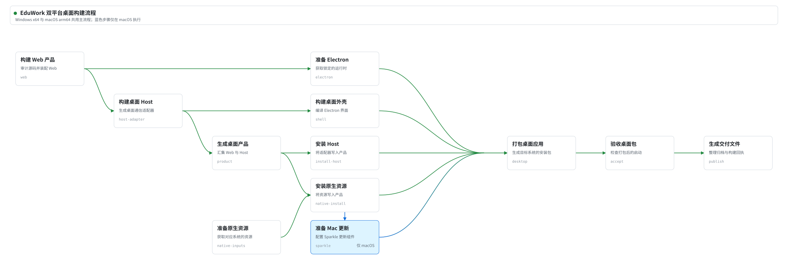

# 跨平台桌面构建流水线提案

**简体中文** | [English](README_EN.md)

状态：本 PR 已实现 Node.js 构建脚本、Windows/macOS 阶段目录、本地入口、缓存与预检。main 更新后自动构建并保留双平台开发包；手动候选工作流可选择 Node 流程构建和发布双平台候选。

## 目标与边界

桌面构建使用同一套 Node.js 工具组织 Web 装配、Host、原生资源、Electron 打包和验收。`scripts/local-desktop-pipeline.mjs` 是本地一键入口；`ci-eduwork-windows-release.mjs` 和 `ci-eduwork-macos-release.mjs` 使用各自平台的阶段目录。Windows 与 macOS 的系统工具、资源包和最终产物仍分别处理，不共享原生二进制。

本提案覆盖桌面构建、验收和 GitHub Release 产物交付。npm 发布、机构部署以及 macOS Developer ID 签名和公证仍遵循各自的授权与验收流程。

图概括双平台从产品、Host 和原生资源准备，到 Electron 打包、启动验收和生成交付文件的主流程。实际构建前置由锁定源码配方提供，macOS 增加 Sparkle 更新组件。图源位于 `docs/assets/build-pipeline.drawio` 和 `build-pipeline.mmd`。

## 已实现设计

- `pinned-source-stages.mjs` 定义开发包与候选共用的源码配方，`windows-stages.mjs` 与 `macos-stages.mjs` 定义平台打包阶段。每个阶段声明 `requires`、`dependsOn`、`outputs` 和 `mutableOutputs`。
- 运行器根据依赖安排顺序与并发；检查点记录参数、输入和产物摘要。复用工作区时，输入或阶段目录变化会使旧检查点失效，产物被修改或缺失会报错。
- 独占工作区锁避免两个构建同时写入同一工作区。大产物可按大小校验，日志和阶段声明保留实际校验强度。
- 原生输入按固定哈希缓存下载，并按源码、补丁、目标架构与工具版本缓存编译结果。缓存恢复时再次校验内容，缓存目录位于源码树外。
- 预检在下载和编译前检查构建工具、目录、上游缓存和固定资源地址；发现问题立即报错。

## 当前接入

| 场景 | 入口 | 状态 |
| --- | --- | --- |
| 本地 Windows x64 / macOS arm64 开发构建 | `node scripts/local-desktop-pipeline.mjs` | 已接入阶段流水线 |
| 双平台开发包工作流 | `development-desktop.yml` → 两平台 Node 阶段入口 | main 更新后自动构建并保留已验收的 artifact |
| 手动双平台候选与发布 | `desktop-candidates.yml` → `node` | Node 编排与锁定的 DSH `0.2.0-rc.2` 候选配方，支持 alpha/beta/rc/dev/stable |
| 旧版源码候选 | `desktop-candidates.yml` → `ps1` | 暂留作锁定源码配方的对照入口 |

开发包以及 `node` 与 `ps1` 候选都使用 `config/desktop-build.json` 选择 `0.2.0-rc.2` 组合：锁定的 npm Runtime、上游源码 Host 和重建的产品插件客户端。Node 流程不调用 PowerShell。两个平台经归档和应用启动检查后，发布任务核对 ZIP、DMG、哈希、回执、Windows 安装包及已批准说明，再上传 GitHub Release。macOS DMG 使用 ZIP 内同一应用并核对只读镜像；stable 构建要求 Sparkle 配置。开发包只上传 artifact，手动候选才可经授权发布。

## 后续事项

仍需完成的验收：

| 项目 | 内容 |
| --- | --- |
| 机构验收 | 公版跳过机构专属检查；机构候选检查签名配置描述文件和首次启动激活。旧流程的私有 `validationScript` 仅由 PowerShell 候选执行，其额外检查需在机构仓对照后迁移，不能记作 Node 已执行。 |
| 实包验收 | 在 Windows x64 与 macOS arm64 上构建并启动新 Node 候选，核对产物与回执。 |
