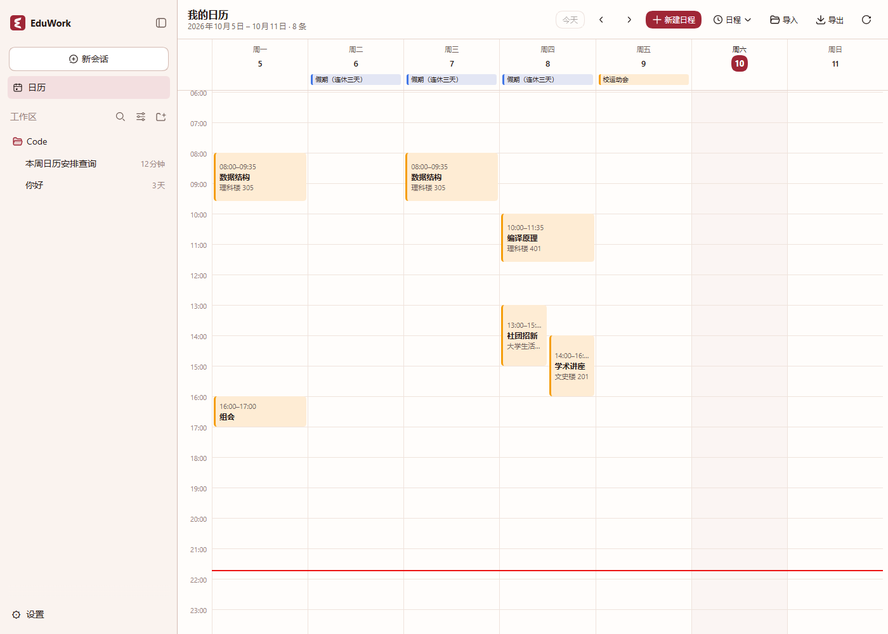
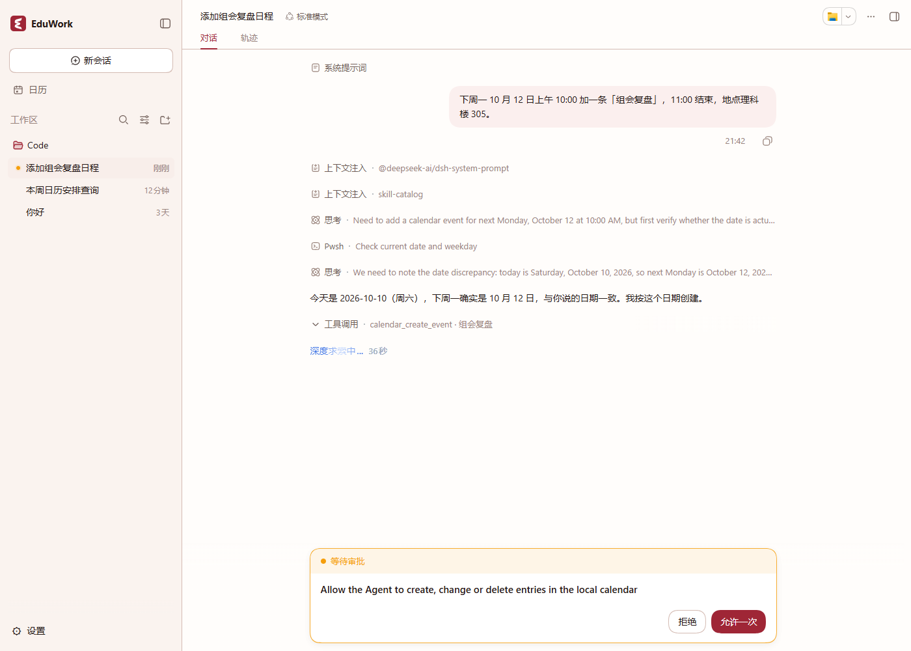

# Calendar and schedule module proposal

[简体中文](README.md) | **English**

Status: steps 1–4 of this proposal are implemented; the code and its usage are documented in the plugin's [README](../../../dsh-plugins/calendar/README.md), and step 5 (the institution injection entry point) has not started. Field names and configuration keys follow the plugin documentation and code; this proposal records boundaries and trade-offs. The verification actually performed, and the parts left unverified, are listed under [Development split and acceptance](#development-split-and-acceptance).

Ownership: public edition (EduWork). Institution data integration is a separate proposal; see [Institution boundary](#institution-boundary).

## Goal

Introduce a standalone calendar and schedule plugin in the public edition: a week view, local event storage, ICS import and export, and an **open data structure** that the institution edition can use to inject school data (academic calendar, class timetable). A timetable is one data source for the calendar module, not a public-edition concept of its own.

The plugin can be used by other DSH applications without installing the EduWork desktop client. It adds no runtime dependency and does not depend on institution credentials, private networks or an adjacent institution repository.

## Plugin identity

| Item | Value |
| --- | --- |
| Release identifier | `eduwork-calendar` |
| Package name | `@eduwork/dsh-calendar` |
| Source | `dsh-plugins/calendar` |
| Panel identifier | `calendar` |
| Form | Built-in source extension: built from source during assembly, not published as a separate npm package |

Naming: in the public edition this capability is a calendar and schedule, not one school's timetable; timetables and academic calendars are data sources for it. Upstream already provides `@deepseek-ai/dsh-schedule` (reminder engine) and `@deepseek-ai/dsh-client-ui-schedule` (read-only reminder list in the conversation header), so this plugin avoids the `schedule` name to prevent conceptual overlap.

Optionality: public-edition plugins are installed with the release by default. This plugin declares itself **removable without intruding on the core**, following the existing UI extensions (`chatecnuWork` in `package.json`: `kind` is `ui-extension`, `removable` is true, `uses` lists the slots it occupies). Removing it does not affect chat, Studio or other capabilities. Whether a user-facing toggle exists is decided by existing settings capability and is outside this proposal.

## Scope

Included:

| Capability | Description |
| --- | --- |
| Week view | First view: events grouped by week, with previous and next week, current week and today markers |
| Local event storage | Events are kept on this machine and survive across sessions |
| ICS import and export | Parse and emit a minimal `VEVENT` set, matching common academic-calendar and timetable data |
| Open data structure | The event contract defined by the public edition, used by the institution edition to inject data |
| Sidebar entry | Reuses the existing `sidebar.panellist` and `main` slots (verified) |

Excluded:

| Item | Destination |
| --- | --- |
| Reminders triggered at a point in time | Separate proposal, see [Reminder boundary](#reminder-boundary) |
| Scraping the academic system, academic calendar, holiday shifts | Institution edition, see [Institution boundary](#institution-boundary) |
| Month view, agenda view, drag-and-drop editing | Later as needed |
| CalDAV, ICS subscription sync, meeting invitations | Out of scope |
| Lecture notes and other course attachments | Later milestone |

## Relationship to existing implementations

### Official foundation

| Package | Role | Relation to this document |
| --- | --- | --- |
| `@deepseek-ai/dsh-schedule` | Host-side reminder engine: one-off, fixed-interval and calendar-rule reminders that survive restarts | Foundation for reminders (separate proposal); this proposal does not duplicate scheduling |
| `@deepseek-ai/dsh-client-ui-schedule` | Read-only reminder list in the conversation header | Different responsibility from a calendar panel; it is not replaced |

Both cover only the existence and due time of reminders. Neither provides a calendar view, event storage or a data-injection entry point, so this proposal does not overlap with them.

### Third-party implementations

The survey is recorded in issue #48 (2026-09-27). Its conclusion: there is no ready-made timetable plugin, and no single implementation covers local storage, reminders, data injection and a week view at the same time. Relevant candidate types:

| Candidate type | Worth reusing | Concern about adopting it directly |
| --- | --- | --- |
| Multi-view calendars (week/month/agenda, drag and drop) | View layout and interaction design | Stops at an earlier DSH API line; single maintainer; brings its own data model and styling |
| Calendar toolkits centred on CalDAV and RRULE | Approach to ICS compatibility and RRULE expansion | Newer versions ship no UI; internal model differs from the open contract here |
| iCal subscription and early-reminder plugins | Product shape of subscription import | Depends on an external subscription source; reminder channel differs from this repository's notification contract |
| Holiday and lunar-calendar plugins | Source of holiday data | Academic calendars and holiday shifts must follow school data and belong to the institution edition |

Any candidate must be re-checked for licence, version line and maintenance status before adoption.

### Reuse paths and admission conditions

This repository already has four established reuse mechanisms. All four could carry calendar capability, with different admission conditions:

| Path | Precedent in this repository | Admission condition | Cost |
| --- | --- | --- | --- |
| Reference the design, implement it here | Several | None | No licence or version burden; work sits in the view and the contract |
| Vendor the source | `dsh-host/vendor/jsonc-parser` (keeps licence and README) | Keep licence and provenance, include in the source audit | Must follow upstream fixes over time |
| Fork as a standalone npm package | `@eduwork/dsh-literature`, forked from a third party and maintained here | Move into `packages/`, rename, adapt to the DSH baseline, **publish to npm**, add a component lock; maintainer involvement required | Heavier dependency and release flow |
| Runtime patch | Session-search backport | Record patch identity, package version and before/after SHA-256 | Only suitable for small fixes |

### Approach taken here: reuse the design, implement it here

This proposal argues for **reusing the design while implementing the code in this repository**:

- The survey itself points this way: no existing implementation covers local storage, reminders, data injection and a week view at the same time, and the most complete candidate is strongest at month view, agenda view and drag and drop, none of which is in scope here.
- Adopting one directly would bring its licence, version line, dependency lock and the duty of following upstream along with it, while the things this proposal actually depends on — the open contract, the host-side injection entry point and notification integration — are not provided by any third party.
- Implementing it here can reuse the existing theme variables and UI primitives, so the styling matches the existing panels from the start instead of being adopted and then reworked.

What is reused: information structure and interaction only — how a week is laid out, how the current time and today are marked, what an event block shows, week navigation and the empty state. Visuals and code are written in this repository.

Constraints:

- Keep zero runtime dependencies, consistent with existing `dsh-plugins/` (none of them declares runtime `dependencies`).
- ICS and RRULE implement only the subset listed under [Recurrence boundary](#recurrence-boundary), following the survey's approach and adding no third-party parser.
- If maintainers prefer to reuse an existing implementation through a fork or vendoring, please name the candidate during review; we will open a separate proposal under the matching admission conditions above. That would change dependency locks and release arrangements.

## Event data structure

The core of the public contract. Fields follow ICS semantics so that no single data source is baked in.

| Field | Type | Required | ICS | Notes |
| --- | --- | --- | --- | --- |
| `uid` | string | yes | `UID` | Stable event identity; preserved on import, generated locally otherwise |
| `title` | string | yes | `SUMMARY` | Title, for example "standup" or "health check"; in an injected timetable it is the course name |
| `start` | string | yes | `DTSTART` | Local time `YYYY-MM-DDTHH:mm`, or a date `YYYY-MM-DD` |
| `end` | string | no | `DTEND` | Without it the event is a date entry or has zero length |
| `location` | string | no | `LOCATION` | Room or other place |
| `description` | string | no | `DESCRIPTION` | Notes |
| `recurrence` | object | no | `RRULE` | See [Recurrence boundary](#recurrence-boundary) |
| `exceptions` | string[] | no | `EXDATE` | Cancelled instances |
| `source` | string | no | — | Origin: manual, imported or institution-injected |
| `extensions` | object | no | `X-*` | Verbatim store for unrecognised fields |

Example (synthetic data):

```json
{
  "schemaVersion": 2,
  "events": [
    {
      "uid": "demo-event-1",
      "title": "Sample talk",
      "start": "2026-03-02T08:00",
      "end": "2026-03-02T09:35",
      "location": "Sample building 101",
      "recurrence": { "freq": "weekly", "count": 16, "byDay": ["mo"] },
      "source": "manual"
    }
  ]
}
```

Conventions:

- What this proposal asks for is an **open structure**: fields may be added, unrecognised fields are kept verbatim, the structure carries `schemaVersion`, and adding optional fields does not change the major version.
- Field naming and time semantics (local time in the first version, without time-zone conversion) are implementation details to be settled during review and do not affect the conclusions above.
- The public contract defines the shape only, not the storage location or file name.

## Why the public edition has no course entity

The first version carried a course in the public contract (a `courses` table, referenced by events through `courseId`). The public edition now holds one kind of record, the event, because a course is not a general calendar concept:

- A calendar's unit of data is "something is scheduled at this time"; a lesson is one source and one grouping of that schedule. Course catalogues, teachers and default rooms are registrar data, and the public edition contains no school-specific logic.
- A "course" entity only has content while somebody maintains its classes, term and curriculum. The public edition has no such source, so that table did nothing beyond surviving an export and an import.
- The institution edition injects a timetable as a **data source**: one lesson is one event, owned and tinted by its `source`, repeated weekly through `recurrence`. The same event structure therefore carries mail, activities and personal plans, with no extra entity per source.

Future lecture notes, assignments and grades attach by course; when that day comes, the injecting side brings the course identity (in `extensions` or within its `source` scope) without changing the public event contract.

## Recurrence boundary

`recurrence` supports only the subset that schedules and academic calendars actually need:

- Supported: `weekly`, `interval`, `count`, `until`, `byDay`
- Not supported: `monthly`, `yearly`, `BYMONTHDAY`, `BYSETPOS` and complex `RDATE` combinations
- Unsupported rules keep the original `RRULE` string on import and degrade to a single event instead of being dropped silently

"Which teaching week, odd or even weeks, holiday shifts" depend on the academic calendar and are institution data; the public edition accepts only generic input such as a term start date.

## ICS boundary

Import and export use a minimal in-house implementation and add no third-party calendar parser.

- Import: `VCALENDAR`, `VEVENT`, `DTSTART`, `DTEND` (dates and local times), `SUMMARY`, `LOCATION`, `DESCRIPTION`, `UID`, `RRULE`, `EXDATE`, `RECURRENCE-ID`; line folding, escaping and UTF-8 follow RFC 5545
- Export: a minimal `VEVENT` set readable by common calendar applications; a recurring event with per-date changes exports its master event together with a `RECURRENCE-ID` event for each change
- The retired `X-EDUWORK-COURSE*` and `X-EDUWORK-NOTE` properties of an earlier shape are recognised on import and dropped: a course is no longer a public-edition concept, and their values now live in the event's own `SUMMARY`/`LOCATION`/`DESCRIPTION`, so they are never written back
- A single date's change or cancellation is written to that event's `overrides` or `exceptions` through `RECURRENCE-ID`, without touching the series; a non-recurring event is rewritten in place instead, since a one-off record has no instance to override
- No full `VTIMEZONE` implementation, no `VALARM` (reminders belong to the notification pipeline), no CalDAV or subscriptions
- Import is an explicit user action; nothing is fetched in the background

## Presentation boundary

The first deliverable conclusion of this proposal (feasibility already verified):

- The panel list slot of the public-edition sidebar is `sidebar.panellist`, a list slot owned by `@deepseek-ai/dsh-client-ui-sidebar`. An entry requires `id` and optionally `order` and `label`; the sidebar renders the row, button, tooltip and highlight.
- Clicking an entry calls `selectPanel(id)`, and the main area switches to the `main` slot entry whose `key` equals that `id`.
- **Conclusion: the left-hand calendar entry the product needs requires no new "left panel" capability**; the two slots above are enough.
- Sidebar label wording and whether a release configuration may override it are listed under [Open questions](#open-questions).



## Agent read and write boundary

The panel is not the only writer: `lib/tools.js` opens the same `calendar` service to the model in a session through five tools — `calendar_list_events` reads one range, while `calendar_create_event`, `calendar_update_event`, `calendar_delete_event` and `calendar_occurrence` write, the last one acting on a single date of a series (move, reset, cancel, restore).

Three boundaries:

- **Every window is finite**: without `from` a read starts 180 days before today, without `to` it ends a year later, and one call may not span more than 3660 days. A weekly series with no end date expands up to whatever bound it is given, so no bound at all would mean four thousand years of dates.
- **A write carries only the fields it changes**: a field left out keeps its stored value and an empty string clears one, while moving a start keeps the entry's duration. An interface that demands a whole record is hostile to a model — one field forgotten there is one field silently lost.
- **The default answer for a write is a confirmation**: `tools/pre-execute` decides from the tool name — reads pass, writes ask, a session already running without approvals passes, and a write with no session behind it is denied (`lib/tool-permission.js`). The tools and the panel write the same records through the same validation; no second data path is added.

Moving one date and updating the whole record are two tools, which is exactly `RECURRENCE-ID` against the series: the model chooses which one it means instead of a `scope` argument deciding it implicitly.



## Data shape and storage

Events are held by the host half; the client half reads a snapshot and renders it. Reasons:

- Institution injection needs a host-side entry point; client-only storage cannot be injected into.
- Later agent tools and reminders need the same data.
- Reminders (separate proposal) subscribe to the same data on the host side instead of parsing it again.

The concrete local storage backend (host storage service or a plugin-owned file) is decided during implementation and is not part of the public contract.

Privacy:

- Events stay on this machine; nothing is uploaded and nothing is written to logs.
- Reminders show only title and place, never the description body, following the existing desktop notification default.
- Institution data access keeps the existing constraints: tokens never enter the plugin, are never written to disk and never logged.

## Reminder boundary

Reminders triggered at a point in time are outside this proposal because they cross the plugin and desktop-shell boundary:

- [Desktop notifications](../../DESKTOP_NOTIFICATIONS_EN.md) currently have four categories — attention, completed, final failure and Studio results — and no "point in time" channel; extending them means a new category and a change to the local event bridge.
- Whether a due reminder can be delivered in a cold session (tray-resident application with no active session) depends on the runtime baseline; the current release line and the candidate line differ here, so the core team must confirm the target baseline.
- Reminders are therefore a separate proposal: settle the event contract and the usable baseline first, then implement.

## Institution boundary

- The public edition contains no school-specific logic: no academic-system address, scraper, academic calendar or holiday rules.
- A data source is currently only the `source` string (ownership, grouping and tint follow it): writing from an injecting side, replacing one source's records and tinting by source all work, but there is **no source registration** — nothing records a source's name, colour or sync policy. That is the half of the roadmap's "data-source registration" still missing; its shape is under [Open questions](#open-questions).
- Following the edition boundaries ([`docs/EDITIONS.md`](../../EDITIONS.md)), the institution edition supplies an adapter under `edition/plugins/`: it converts school data to the public structure above and injects it through the host-side entry point provided by the public edition.
- Raising the institution lock depends on a public **release**: assembly in institution mode validates the public commit and the source receipt, so institution integration happens after this work lands and is released, and is outside this proposal.
- An offline path also works: the institution side saves an academic-system page, parses it into ICS or the JSON above, and uses the generic import, with no dependency on a school API.

## Compatibility boundary

- Adds one standalone plugin; existing public exports, configuration keys and data paths are unchanged.
- Adds no runtime dependency, changes no dependency lock, and adds no npm package that needs separate publishing (built-in source extensions are rebuilt during assembly).
- Two public interfaces ask for review: the event data structure, and the remote method surface the client half reads and writes through (currently 10 methods). Both are defined in `lib/typert-schemas.js` and `lib/typert-descriptors.js`, in one description shared by the host and the client.
- The release manifest gains one plugin entry; the order and configuration of existing plugins do not change.
- No released data format to migrate: this is the plugin's first introduction. The record contract dropped `courseId` during development, and such an older record is read compatibly and rewritten into the current shape once when the store opens.
- The desktop shell, updater and institution repository are untouched; reminders are a separate proposal.
- Desktop behaviour needs independent acceptance; this proposal is verified on a Web assembly first.

## Development split and acceptance

1. Plugin skeleton and registration: the sidebar entry and the main-area panel work (delivered).
2. Event model and local storage: synthetic round trip, survival across restarts, `node --test` unit tests (delivered).
3. Week view: week navigation, current week and today markers; a UI verification script and screenshots (delivered).
4. ICS import and export: field mapping on synthetic samples, line folding and escaping, syntax check of the output; a round trip that keeps unrecognised fields (delivered).
5. Institution injection entry point: define the host-side entry point in the public edition, verify it with a synthetic adapter and no institution data (not started).
6. Agent read and write interface: five tools covering a range read and four kinds of write, every write behind one confirmation; unit tests and registration in the assembly (delivered).

Verification performed: the plugin's unit tests pass (81 cases) on both pinned runtime lines — `release-v0.1.5-rc.2` for the generic Web product and `candidate-v0.2.0-rc.2` for the desktop candidate; the interface was walked through end to end in a generic Web assembly on this machine; the desktop candidate line's client is rebuilt and checked by the candidate assembly pipeline, but the full candidate product was not run here.

Every pull request reports the verification actually performed and the parts left unverified. Module checks follow the existing CI; real sign-in, Office, audio and video, and desktop behaviour are accepted locally according to the change. macOS desktop notifications need acceptance on real hardware; a browser test is not a substitute.

## Open questions

- The final shape and naming of the event contract.
- The form of the institution injection entry point: a host-side service, release configuration, or both.
- **The shape of source registration**: where a source's name, colour, order and sync policy are recorded (plugin configuration, release configuration, or the institution adapter's own declaration), and how an unregistered source degrades. Today only the `source` string exists: tinting by source and replacing one source's records are implemented, registration itself is not.
- Ownership of the reminder contract: a new notification category or an existing one, and the target runtime baseline.
- Sidebar label wording, and whether the release manifest can override plugin configuration.
- Whether to reuse an existing implementation through a fork or vendoring; if so, which candidate.
- Whether a month view or other views are needed, and their scheduling.
