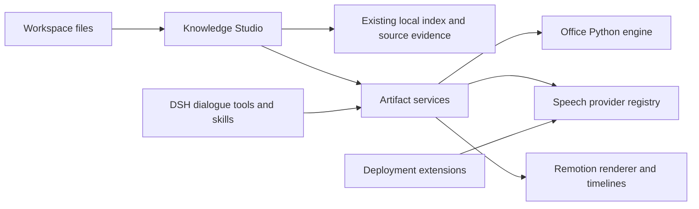

# Architecture

## Studio navigation and artifact lifecycle

On official DSH `0.1.5-rc.1`, Studio registers a native Sidebar tab and Start entry. The host owns collapse/fullscreen, per-session tab restoration and global main panels. Studio renders inside that tab without an overlay, custom expand control or parallel fullscreen state. Drafts, artifact selection and learning progress remain per session.

Legacy hosts retain `plugins/dsh-knowledge-studio/ui-preferences.json` and preference RPC compatibility. The current Sidebar client neither reads nor writes that preference and does not use it to open new-session tabs. Those files remain intact for older integrations.

For conversation tools, an artifact records the durable session ID, turn number,
call ID, optional `targetKey`, and prior `attempts`. The tool receives the actual
attempt result so the model can repair failures. List/read presentation remains
in progress until the host emits `session/event` with `turn/end`; then the actual
result settles. `retryArtifactId` or the original `targetKey` revises that same
deliverable even after an attempt successfully exported a file. Each revision
retains the earlier content, citations and export paths in `attempts`; native
exports use a separate attempt directory. Only the final version appears in the
recent list. A changed title or focus does not create a new deliverable. Without
an explicit ID/key, a unique unkeyed, finished attempt of the same kind and
source scope is reused. Running/ambiguous targets, different explicit keys,
sessions, workspaces and turns are not silently combined. Explicit keys identify
separate requested outputs, never revision numbers.

If the last revision fails, settlement retains the latest successful version,
with `revisionWarning` and the failed revision in history. If no attempt succeeded,
the failure remains visible. Restart recovery applies the same rule without
discarding saved files or resurrecting deleted entries. Standalone RPC tasks
settle when their own executor finishes. Existing historical records are not
guessed into new groups. The client refreshes previews/downloads when a version
or export identity changes, even when the artifact ID stays the same.

PPTX files retain full validated semantic input and notes. When a template's
physical text area is too small, Shared wraps and continues readable fixed pages,
preserving two-column grouping. Field/type errors still fail. Creation returns
actual `slide_count`, `source_pages` and `adaptations`; Studio stores these on the
file as `pageCount`, `sourcePages` and `adaptations`. Preview reads the actual
file, including continuation pages, and does not recreate layout in the browser.



Studio owns source selection, citations, UI, saved artifacts and learning progress. The shared package has no dependency on Studio, Memory or a particular institution. DSH owns sessions, models, filesystem access, approvals and cancellation. `artifactServices` is registered once at Host scope; both Studio and tools use that instance. Assemblies can set `{skills:false}` and register the same six bundled skills through their product settings.

Shared Office tools are `office_document`, `office_spreadsheet`, `office_presentation`, `office_pdf`. Media tools are `speech_voices`, `speech_synthesize`, `media_render`, `video_project`. ASR tools are `speech_transcription_providers` and `speech_transcribe`. Image provider discovery/generation tools are installed only when explicitly enabled; they do not add an infographic Studio. Write operations retain the original DSH Agent context and approval hooks. Low-level JavaScript APIs are intended for applications that enforce their own authorization and output directories.

## Application APIs

```js
import {runOffice, normalizeOfficeRequest} from '@eduwork/dsh-artifact-services/office'
import {SpeechService} from '@eduwork/dsh-artifact-services/speech'
import {renderMedia} from '@eduwork/dsh-artifact-services/media'
import {runVideoCommand} from '@eduwork/dsh-artifact-services/video-runner'
import {createMediaRuntime, getMediaFFmpegPath} from '@eduwork/dsh-artifact-services/runtime'
```

See the [shared package README](https://github.com/ecnu/EduWork/blob/main/packages/dsh-knowledge-studio/packages/artifact-services/README.md) for working request examples. A speech adapter implements `id`, `title`, `voices()` and `synthesize(request)`. The request carries exact text, voice, speed, an authorized directory, cancellation and optional ephemeral host execution context. Return an actual WAV file; the service measures its bytes to determine duration. Provider failures remain failures, with no silent vendor or voice substitution.

DSH extensions register through `ctx.artifactServices.registerSpeechProvider(provider)` and `registerBackgroundMusic(track)`, keeping credentials and governed vendor tools in the extension. Music entries include a file path, SHA-256 and provenance. Extensions dispose their registrations when unloaded.

Structured audio/video and editable React projects share the renderer and timing utilities. The editable starter is a distinct template, not another renderer. The managed media runtime uses Remotion 4.0.520, mediabunny 1.55.5 and React/React DOM 18.3.1. Six licensed 192 kbps MP3 tracks share one catalog; TTS remains WAV. Existing legacy environment variables, project markers and historical audio formats remain supported; new generic narration uses WAV and a voice discovered from the provider registry.

## Persistence

Agent tools default to `knowledge_studio_create_artifact` only. Integrations that
maintain an optional local index can explicitly configure `indexedRetrievalTools:
true` to expose the legacy index status/search/read/neighbors tools. Index state
is not a prerequisite for Studio creation; ordinary source reads use host tools.
`pathPrefix` selects existing input sources, never the Studio output location.
An empty explicit scope fails without silently widening that scope.

Shared Office and structured media tools accept a direct object `spec`. Legacy
`spec_json` is still supported, but callers must supply exactly one form. Parsing
never rewrites backslashes or guesses how double-encoded document text was meant.

Artifact generation uses `generation.js` for independent, cancellable model requests and citation snapshots. Existing local indexes support retrieval; unindexed workspaces use original files through `basicEvidence`. Wiki generation, its tools, RPC methods, settings and reader are excluded from this build. Old database tables, task records and saved artifacts are retained without a Wiki migration or automatic resume.

The settings namespace remains `dsh-knowledge-studio`. Knowledge stays under `DSH_HOME/plugins/dsh-knowledge-studio/workspaces`; artifact metadata uses `artifacts.json`, with exports alongside it. Package scope changes do not rename these locations. Generated workspace jobs use `.artifacts/media` and editable projects retain the legacy `.ecnu-agent/video-projects` location to preserve existing project references.

Package/RPC ownership is `@eduwork/dsh-knowledge-studio`; the `knowledgeStudio` and `artifactServices` service identifiers and Cordis row IDs remain stable. No strong dependency on the Memory plugin is introduced.

## Preview and delivery ownership

Studio and conversation attachments reuse `renderOfficePreview` and `mountOfficePreview` for actual Office bytes. The shared viewer controls inherit host theme tokens, while document pages retain authored colors. Paging and zooming do not regenerate documents. Media playback reads actual output files. The consuming host supplies official Sidebar file tabs, ordinary document preview and system-open actions.

Conversation skills guide the model to call official `present` for verified final outputs when available. Intermediate revisions are not automatically delivered. Internal Studio generation retains artifact lifecycle/settlement; it does not create a competing delivery service. Shared design references and content guidance are reused, but structured Studio videos and editable React projects have different editing capabilities and are not promised to round-trip losslessly.
