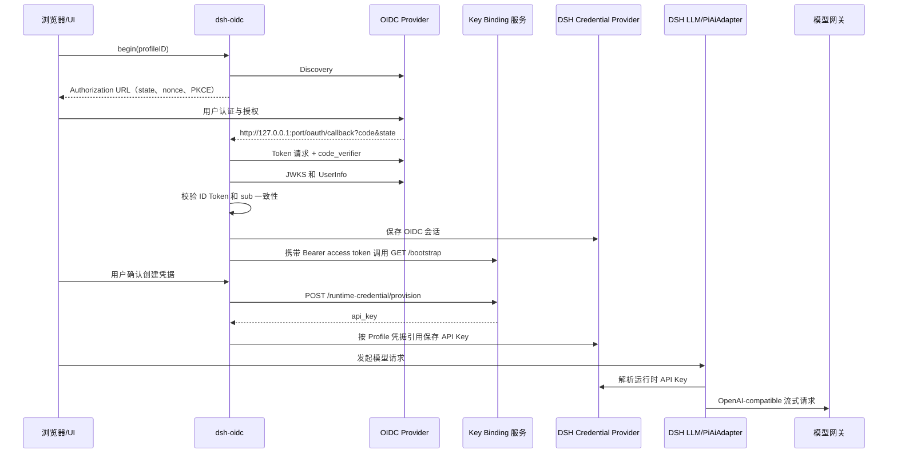

# 架构与边界

**简体中文** | [English](architecture.en.md)

## 目标

`dsh-oidc` 让机构无需 fork DSH，也无需依赖桌面外壳，就能把身份、授权、模型凭据、Provider 元数据和有边界的品牌能力接入普通 DSH Host。

设计遵循五条规则：

1. **DSH 负责运行时。** 插件使用 DSH 官方服务和 `PiAiAdapter`，不另建对话或模型传输栈。
2. **身份遵循标准。** 认证使用 OIDC Discovery、Authorization Code + PKCE、ID Token、UserInfo、刷新和可选撤销。
3. **机构服务是一个完整交付边界。** 托管模型模式要求服务所有者共同交付 OIDC、固定 Key Binding 和模型网关；纯身份模式只需 OIDC。Profile 只能声明这些协议表面的公开地址与事实。
4. **配置是数据，不是代码。** Profile 不能选择可执行 adapter、任意接口路径、脚本、样式表、工具或 Skill。
5. **产品特有能力围绕核心组合。** 通用企业模型设置界面属于 `dsh-oidc`；桌面外壳、配额视图、模型转换或机构业务页面仍由独立插件或服务承担。

## 运行时组件

| 组件 | 职责 | 信任级别 |
| --- | --- | --- |
| DSH Host | 生命周期、Cordis 服务、LLM 注册、WebServer、凭据和附件 | 受信任的可执行宿主 |
| `dsh-oidc` Host 端 | Profile 校验、OIDC 客户端、Key Binding 客户端、本地 Provider 注册 | 受信任的本地插件 |
| `dsh-oidc` Client 端 | 账号/引导界面、共用企业模型设置和有边界的品牌替换 | 受信任的本地插件 |
| Enterprise Profile | 声明式集成事实 | 受信任配置，但仍以失败关闭方式校验 |
| 机构企业模型集成服务 | 联合提供 OIDC 身份、Key Binding 授权/凭据生命周期和 OpenAI-compatible 模型网关 | 远程安全、授权和数据处理权威 |
| 能力插件 | 可选的请求级转换，例如图像转文本回退 | 单独受信任的本地插件 |

## 控制流



图中 OIDC Provider、Key Binding 和模型网关是同一份[服务端接口规范](server-integration-contract.md)的三个接口组。它们可以在机构内部拆成不同系统或域名，托管模型模式需要三组完整服务；纯身份模式可以省略两个模型资源组。Web 回调始终返回本机 `127.0.0.1`，不经过机构公网 DSH 地址。

## 代码布局

- `src/host/index.js`：DSH 服务入口和 Typert 远程方法。
- `src/host/oidc.js`：Web/desktop 共用 OIDC 实现及旧 native adapter。
- `src/host/desktop-oidc.js`：临时 loopback 登录与取消。
- `src/host/profile.js`：校验、导入、公共投影和 Provider 投影。
- `src/host/provider/`：本地 DSH/PiAi Provider adapter 和转换扩展点。
- `src/client/`：DSH 浏览器 bundle、账号界面和远程描述符。
- `schema/`：机器可读的 Enterprise Profile 契约。
- `protocol/openapi.yaml`：机器可读的 Key Binding 契约。
- `docs/`：规范正文、威胁模型和集成指南。

Host 端文件保持为可读的原生 ESM，并在构建时复制到 `lib/`。Client 端代码被打包为 DSH module-loader 的闭包格式。发布包同时包含构建产物和两份机器可读契约。

## 身份边界

Web 后端只以 OIDC 作为认证和身份来源，并只在 DSH WebServer 精确监听 `127.0.0.1` 时启动。插件绑定三个值：

- 配置的 issuer；
- 配置的 public client ID；
- 经认证且在 ID Token 与 UserInfo 中一致的 `sub`。

`userinfo.name` 只用于显示，缺失时降级到 `userinfo.sub`。Key Binding `bootstrap.subject` 即使存在也只是信息字段，不能覆盖身份。这样可防止私有管理 API 悄悄变成第二套不兼容的身份协议。

## 凭据边界

Key Binding 服务在每次 resolve/provision/renew 响应中返回模型 API Key。`dsh-oidc` 将其写入 Enterprise Profile 解析后的 DSH 凭据引用。默认值统一为机构无关的公共引用：

```text
EDUWORK_API_KEY
```

旧自动引用按 Profile 规则兼容到 `EDUWORK_API_KEY`，其他显式引用保持不变。模型 Key 指纹与已验证身份及完整资源绑定一起保存在 Host 会话中；任何网络使用和登出清理都要求当前值仍归属于该会话。指纹不通过 RPC、日志或对话输出。迁移范围见 [Profile 规范](enterprise-profile.md)。

Provider adapter 在请求时解析该引用。它不会读取环境中的 pi-ai 凭据存储，也不会把密钥放入 Enterprise Profile、UI payload、日志或 DSH 对话记录。Web 后端和 native 后端使用同一 Profile 规则；native `enterpriseAccounts` 只是宿主能力适配器，不拥有凭据命名策略，若返回不一致的引用会被拒绝。

凭据存储安全性委托给当前 DSH Credential Provider。这是一项明确的宿主契约，并不意味着任意 DSH 部署都天然具备多用户安全性。

## Provider 所有权与扩展

托管资源 Profile 声明 Provider ID，以及本地模型或发现模式；纯身份 Profile 不声明 Provider。`dsh-oidc` 通过 DSH 官方 `PiAiAdapter` 和 `@earendil-works/pi-ai` 的 OpenAI Completions 实现拥有这些路由。

可选功能插件可通过 Cordis 服务 `enterpriseTransforms` 注册转换。转换可以：

- 为指定 Provider/模型声明聚合后的输入模态；
- 重写即将发送给 Provider 的请求；
- 检查模型的原生模态。

转换不得修改持久对话记录，也不得为同一路由注册竞争 adapter。因此，原生多模态路由可绕过仅面向文本模型的图像理解回退，而纯文本路由可以选择接入该能力。

## Desktop 与旧 native 边界

新桌面使用 `backend: desktop`：临时 loopback 回调和官方浏览器服务在 Wails/Electron 间共享 OIDC/Key/模型实现，凭据存储仍由宿主提供。旧 `backend: native` 仅为已有桥接委托 `enterpriseAccounts`。见[桌面集成](desktop-host.md)。

共用 UI 使用官方 `settings.models.footer`、onboarding、侧栏和通用设置插槽。机构配置是只读可信数据；旧桥的可变管理方法只是兼容 API，不是新机构的默认 UI 或必需接口。`models-only` 只挂共用模型设置，`external` 关闭插件 UI。配额和心跳由显式安装的机构扩展提供。

## 明确排除

- 任意 UserInfo endpoint 或 claim 路径映射；
- 任意 Key Binding 路径或字段；
- 远程模块、CSS、工具或 Skill；
- 模型配额和机构目录协议；
- 共享多用户 DSH Host 的服务端 Web 会话；
- 动态 Provider adapter 选择。

这些排除项减少协议歧义，并让可执行信任边界保持在本地、可审查范围内。
