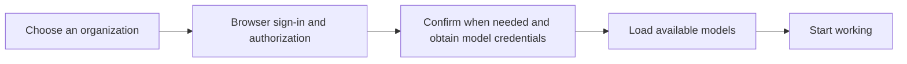

# Open Identity and Model Integration Initiative

[简体中文](open-integration.md) | **English**

**Make institutional accounts and model services reusable across AI clients.**

Schools and businesses already have identity systems and are building model services. Users want to sign in with a familiar account and start working in their chosen AI client. Our aim is for one server implementation of an open contract to serve multiple compatible clients, and for a client to connect another organization primarily through configuration.

EduWork puts this into practice through `dsh-oidc`. We invite identity platforms, model gateways, client developers, and plugin authors to improve the contract together.

> Status: this is a community initiative. The accompanying RFC EW-IDENTITY-1 documents implemented interfaces, with future protocol changes open for discussion. It is not a standard published by DSH, the OpenID Foundation, or the IETF, and does not imply that other clients are already compatible.

## The experience we want to enable

A user selects an organization, signs in through the system browser, grants authorization, and confirms credential creation when required. The client then loads the organization's models so the user can start a task. Personal API keys and other models remain available.

This is the intended managed-model experience. An organization that only needs identity can start with OIDC alone and let users configure their models, without first building a model-credential service.

| Participant | Work we hope to reduce together |
| --- | --- |
| Users | Repeatedly copying keys, finding endpoint addresses, and entering model parameters. |
| Schools and businesses | Reimplementing identity and model integration for each client. |
| Client developers | Maintaining a separate sign-in, credential, and model adapter for every organization. |
| Plugin authors | Implementing another sign-in flow or storing another copy of a user's credentials in a tool plugin. |

## What we propose to agree on

1. **Use existing identity standards.** Use OpenID Connect with PKCE for local public clients, and derive identity from verified OIDC results. Resource services authorize model access without replacing the identity source.
2. **Define an open model-access contract.** Specify requests and responses for credential state, provisioning, resolution, renewal, and model catalogs. OIDC handles identity; model credentials and catalogs require separate resource APIs. Successful sign-in alone does not establish model integration.
3. **Keep institution configuration as data.** Declare branding, trusted endpoints, and model policy in local configuration. Configuration cannot deliver scripts, install tools, or replace executable modules. Add behavior through explicitly installed plugins.
4. **Preserve user choice and institution boundaries.** Institutional and personal models can coexist. Public integration does not require a particular school, desktop shell, quota system, or activity heartbeat. Institution-specific capabilities remain optional extensions.
5. **Make compatibility verifiable.** Document fields, errors, versions, and migrations in specifications, OpenAPI, examples, and tests. Follow the [compatibility policy](compatibility.en.md) when changing the protocol, so clients do not have to guess.

## Build on the existing implementation

The protocol and client implementation are available for server integration and client interoperability work.

| Part | Current scope | Start here |
| --- | --- | --- |
| Identity | OIDC Discovery, Authorization Code + PKCE, Token, JWKS, and UserInfo, including identity-only mode. | [OIDC interoperability requirements](oidc-interoperability.en.md) |
| Managed credentials | Bootstrap and the provision, resolve, and renew lifecycle endpoints. | [Complete server interfaces and requests](server-integration-contract.en.md) · [Key Binding OpenAPI](../protocol/openapi.yaml) |
| Model catalog | A static catalog in trusted configuration, or explicitly enabled `/models` discovery. | [Client modes and model discovery](public-resource-protocol.en.md) |
| DSH client | The independent npm package `@eduwork/dsh-oidc`, used by EduWork and available to other compatible DSH hosts. | [Module guide](../README_EN.md) · [Desktop host integration](desktop-host.en.md) |
| Institution extensions | Configuration, skills, and plugins that reuse public integration capabilities. | [EduWork@ECNU example](https://github.com/ecnu/EduWork-ECNU) |

A server must implement the interfaces required by its selected mode. This repository does not include a deployable OIDC or Key Binding server. Current clients are single-user local applications; local Web is for validation and does not provide shared multi-user sign-in sessions.

Remote organization-profile discovery and remote model-key revocation remain optional proposals in the RFC. Quota and activity heartbeats remain institution extensions. Proposals or capability declarations do not activate unimplemented features. The model gateway uses the documented OpenAI Chat Completions compatible contract; other model and media APIs require separate validation against their own contracts.

Other clients can implement these network interfaces without adopting EduWork's UI or desktop shell. Interoperability depends on the declared protocol versions and actual integration results.

## How to participate

- **Identity and model platform developers:** start with the [server specification](server-integration-contract.en.md) and [integration guide](getting-started.en.md). Contribute sanitized examples and explain constraints that are difficult for existing platforms to meet.
- **Client developers:** integrate `dsh-oidc` or implement the network protocol independently. Verify sign-in, credential lifecycle, model catalogs, and error handling; share interoperability results with explicit version information.
- **Plugin authors:** connect institution capabilities through the [account extension interfaces](account-extensions.en.md), reusing the host's authorized transport and account state where possible.
- **Specification contributors:** describe use cases and compatibility issues in [EduWork Issues](https://github.com/ecnu/EduWork/issues). Discuss interface changes first, then update the specification, machine-readable contract, examples, and necessary tests following the [contribution guide](../CONTRIBUTING.en.md).

Implementations from different organizations and clients are welcome. Use placeholder configuration and synthetic data in examples; report authentication vulnerabilities and credential issues through the [security reporting process](../SECURITY.en.md).

## Relationship to the DSH plugin ecosystem

[DSH Desktop's plugin ecosystem initiative](https://github.com/anywhere-labs/dsh-desktop/blob/master/docs/plugin-ecosystem.en.md) promotes plugin composition and collaboration. We share that direction and aim to contribute implementable, discussable public interfaces for identity and model access. The initiatives are independent; this reference does not imply that DSH Desktop has adopted this protocol.

The next result we hope to establish together is that one institutional service can connect to more clients through a clear protocol and a small amount of configuration, and continue working across upgrades.
