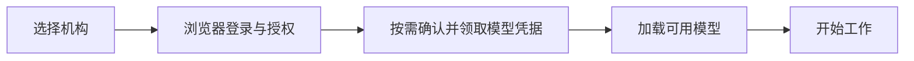

# 开放身份与模型接入倡议

**简体中文** | [English](open-integration.en.md)

**让机构的账号与模型服务，被更多 AI 客户端复用。**

学校和企业已经有自己的账号体系，也在建设模型服务。用户希望用熟悉的账号登录，在自己选择的 AI 客户端里开始工作。我们希望服务端实现一套公开接口后，能够服务多个遵循同一约定的客户端；客户端新增一个机构时，也能主要通过配置完成接入。

EduWork 从 `dsh-oidc` 开始实践这件事，并邀请身份平台、模型网关、客户端和插件作者一起完善这套约定。

> 状态：这是一份面向社区的倡议。配套的 RFC EW-IDENTITY-1 描述已有实现的接口，后续协议演进开放讨论；它不是 DSH 官方、OpenID Foundation 或 IETF 发布的标准，也不代表其他客户端已经兼容。

## 用户应当得到什么

用户选择机构，在系统浏览器完成登录，授权并在必要时确认创建模型凭据。客户端随后加载机构提供的模型，用户即可开始任务。个人 API Key 和其他模型仍然可以使用。

这是托管模型模式的目标体验。只需登录身份的机构可以从纯 OIDC 模式开始，用户自行配置模型；不必先建设模型凭据服务。

| 参与者 | 我们希望共同减少的工作 |
| --- | --- |
| 使用者 | 反复复制 Key、查找接口地址和填写模型参数。 |
| 学校与企业 | 为每个客户端重复编写身份和模型接入逻辑。 |
| 客户端作者 | 为每个机构维护一套专有登录、凭据和模型适配。 |
| 插件作者 | 在工具插件里再次实现登录或另存一份用户凭据。 |

## 共同约定什么

1. **身份遵循已有标准。** 使用 OpenID Connect 与适合本机公共客户端的 PKCE 登录流程，用户身份以经过验证的 OIDC 结果为准。资源服务负责模型授权，不替换身份来源。
2. **模型接入有公开契约。** 明确凭据状态、申请、读取、轮换和模型目录的请求与响应。OIDC 负责身份；模型凭据与目录使用另外定义的资源接口，不能把完成登录等同于完成模型接入。
3. **机构配置保持为数据。** 品牌、受信任端点和模型策略由本地配置声明；配置不能下发脚本、安装工具或替换执行模块。需要新增行为时，通过显式安装的插件接入。
4. **保留用户选择和机构边界。** 机构模型与个人模型可以共存。公共接入不要求某所学校、某个桌面壳、配额系统或活跃心跳；机构专属能力按需扩展。
5. **兼容性可以核验。** 字段、错误、版本和迁移方式写入规范、OpenAPI、示例与测试。协议变化遵循[兼容性策略](compatibility.md)，不让客户端靠猜测完成接入。

## 从现有实现开始共建

协议和客户端实现随源码提供，可以据此开展服务端接入及客户端互操作验证。

| 部分 | 当前范围 | 阅读入口 |
| --- | --- | --- |
| 身份接入 | OIDC Discovery、Authorization Code + PKCE、Token、JWKS、UserInfo；支持纯身份模式。 | [OIDC 兼容要求](oidc-interoperability.md) |
| 托管凭据 | Bootstrap，以及 provision、resolve、renew 生命周期接口。 | [服务端完整接口与请求示例](server-integration-contract.md) · [Key Binding OpenAPI](../protocol/openapi.yaml) |
| 模型目录 | 可信配置中的静态目录，或显式启用的 `/models` 自动发现。 | [客户端模式与模型发现](public-resource-protocol.md) |
| DSH 客户端 | 独立 npm 包 `@eduwork/dsh-oidc`，由 EduWork 使用，也供其他兼容 DSH 宿主集成。 | [模块说明](../README.md) · [桌面宿主接入](desktop-host.md) |
| 机构扩展 | 配置、技能和插件组合，复用公共接入能力。 | [EduWork@ECNU 示例](https://github.com/ecnu/EduWork-ECNU) |

服务端需要按所选模式提供相应接口；本仓库不包含可直接部署的 OIDC 或 Key Binding 服务端。现有客户端都是单机应用，本机 Web 用于验证，不提供多人共享的登录会话服务。

远程机构配置发现、远端模型 Key 注销等内容仍在 RFC 的可选扩展提案中；配额和活跃心跳继续由机构扩展处理。文档中的提案和能力声明不会自动启用未实现的功能。模型网关采用本文档规定的 OpenAI Chat Completions 兼容接口，其他模型及媒体接口须按各自契约另行核验。

其他客户端可以独立实现这些网络接口，不必采用 EduWork 的界面或桌面壳。能否互通，以双方声明的协议版本和实际联调结果为准。

## 你可以从哪里参与

- **身份或模型平台开发者**：从[服务端接口规范](server-integration-contract.md)和[接入指南](getting-started.md)开始，提供经过脱敏的接入示例，反馈现有平台难以满足的约束。
- **客户端作者**：尝试复用 `dsh-oidc`，或独立实现网络协议；验证登录、凭据生命周期、模型目录及错误处理，分享注明版本的互操作结果。
- **插件作者**：通过[账户扩展接口](account-extensions.md)接入机构能力，优先复用宿主授权传输与账户状态。
- **规范贡献者**：在 [EduWork Issues](https://github.com/ecnu/EduWork/issues) 描述场景与兼容性问题；修改接口前先讨论设计，并按[贡献指南](../CONTRIBUTING.md)同步规范、机器契约、示例和必要测试。

我们欢迎不同机构、不同客户端的实现参与。示例请使用占位配置和合成数据；认证漏洞与凭据问题通过[安全报告入口](../SECURITY.md)反馈。

## 与 DSH 插件生态的关系

[DSH Desktop 的插件生态倡议](https://github.com/anywhere-labs/dsh-desktop/blob/master/docs/plugin-ecosystem.md)推动插件之间的组合与协作。我们认同这个方向，希望在身份与模型接入这一环节提供可实现、可讨论的公共接口。这两份倡议各自独立；引用并不表示对方已经采纳本协议。

下一步希望共同验证的是：同一个机构服务能否通过清晰的协议和少量配置，接入更多客户端，并在升级后继续工作。
